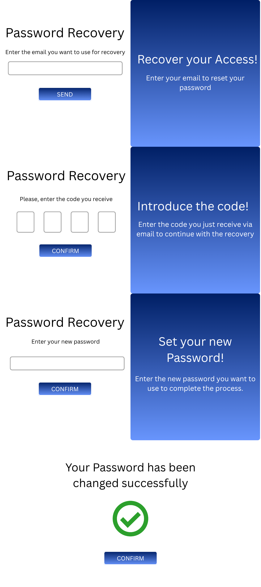

# MLB Portal

## 🧾 Table of Contents
- [Authors](./docs/Authors.md)
- [Project Tracking](./docs/ProjectTracking.md)
- [Application Functionality](#-application-functionality)
- [Methodology](./docs/Methodology.md)
- [Objectives](./docs/Objectives.md)
- [Application Analysis](./docs/AppAnalysis.md)
- [Execution Instructions](./docs/Instructions.md)
- [Development Guide](./docs/DevelopmentGuide.md)
- [User Stories](./docs/UserStories.md)
- [Page Layouts and Navigation](#-page-layouts-and-navigation)
  - [1: Login, Registration and Password Recovery](#1-login-registration-and-password-recovery)
  - [2: Headers](#2-headers)
  - [3: Footer](#3-footer)
  - [4: Home](#4-home)
  - [5: Teams](#5-teams)
  - [6: Standings](#6-standings)
  - [7: Profile](#7-profile)
  - [8: My Tickets](#8-my-tickets)
  - [9: Favourite Teams](#9-favourite-teams)
  - [10: Ticket Selection](#10-ticket-selection)
  - [11: Ticket Purchase](#11-ticket-purchase)
  - [12: Contact Support](#12-contact-support)
  - [13: Team Information](#13-team-information)
  - [14: Player Information](#14-player-information)
  - [15: Edit Menu](#15-edit-menu)
  - [16: Create Match](#16-create-match)
  - [17: Matches](#17-matches)
  - [18: Update Scoreboard](#18-update-scoreboard)
  - [19: Statistics](#19-statistics)
- [0.1 Version](#-01-version)
- [0.2 Version](#-02-version)
- [1.0 Version](#-10-version)
- [Bibliography](./docs/Bibliography.md) 
- [License](#-license) 

## ⚾ Application Functionality
The app is a portal dedicated to Major League Baseball (MLB), offering general league information, as well as detailed information on teams, players, standings, and other relevant aspects.

In addition to these basic functions, users can register to access exclusive features, such as purchasing tickets for their favorite games, selecting favorite teams to customize the information displayed, and the ability to enable or disable email notifications with the latest league news from their profile.

The platform also has administrator users, responsible for the internal management of the app, including updating information on teams, players, and other content.

The main objective of this app is to offer baseball fans a comprehensive and up-to-date space to follow MLB and the performance of their favorite teams throughout the season.

At this time, the functional and technical objectives are only defined but not implemented.

## 🔀 Page Layouts and Navigation

> [!NOTE]
> The images shown below represent the initial designs for each page of the application. To view the final versions, please refer to the section corresponding to the release in which these pages were completed.
>  
> For version 0.1 click [here](#-01-version).
>  
> For version 0.2 click [here](#-02-version).
>  
> For version 1.0 click [here](#-10-version).

### 1: Login, Registration and Password Recovery

A classic login form where the user, in order to access the application, must enter their username and password. In case the user has forgotten their password, they can establish a new one by clicking the "Forgot Your Password?" link. If the user does not have an account, they have the option to create one by clicking the "SIGN UP" button, which redirects them to the registration form.

A classic registration form where the user, in order to create an account, must enter a username, email and password. If everything goes well, the success message will be displayed. In case the user already has an account, they can go to the login form by clicking the "SIGN IN" button.

As you can see, these forms are very similar, with the main difference being that the blue panel switches sides depending on the form (left or right). When the user switches between the sign-in and sign-up forms, this change is displayed as an animation, where the blue panel smoothly slides to the opposite side while the form panel moves accordingly.

These pages will be displayed sequentially on the same screen, with transitions between each step. In the first layout, the user will need to enter their email address to receive a verification code. After clicking 'SEND', the user will enter this code, and finally, in the last layout, they will set a new password. If everything is successful, a confirmation message will be shown, and the user will be able to log in to their account with the new password.

### 2: Headers

Depending on the type of user, a different header will displayed. These headers are:
#### Anonymous User:
- **Login:** Redirects the user to the login form, allowing them to access the exclusive features the application provide.
- **Sign-Up:** Redirects the user to the registration form, allowing them to create an account.
- **Teams:** Displays a list of all the teams in the league. By clicking on any of them, the user can view detailed information about that team.
- **Standings:** Redirects the user to the [Standings Page](#6-standings), where all the standings for the different leagues and divisions are shown.
- **Profile Icon:** Redirects the user to the [Login Form](#1-login-registration-and-password-recovery).

#### Registered User:
- **My Tickets:** Redirects the user to a page where all the tickets they have purchased are displayed.
- **Fav Teams:** Redirects the user to a page dipslaying all the teams they have selected as favourites.
- **Teams:** Displays a list of all the teams in the league. By clicking on any of them, the user can view detailed information about that team.
- **Standings:** Redirects the user to the [Standings Page](#6-standings), where all the standings for the different leagues and divisions are shown.
- **Profile Icon:** Redirects the user to the [Profile Settings Page](#7-profile), where all the user`s data is displayed and can be edited.

#### Admin User:
- **Edit Info:** Redirects the admin to the [Edit Menu](#15-edit-menu), where they can search for the team, player or stadium they want to edit.
- **Matches:** Redirects the admin to the [Matches Page](#18-matches), where the matches of the day are displayed and the admin can select a match to edit.
- **Create Match:** Redirects the admin to the [Create Match Form](#16-create-match).
- **Statistics:** Redirects the admin to the [Statistics Page](#19-statistics), where the admin can see the statistical data of **"User´s Favourite Teams"** and **"Ticket Selling per Teams"** reflected graphically.
- **Profile Icon:** Redirects the user to the [Profile Settings Page](#7-profile), where all the user`s data is displayed and can be edited.

> [!NOTE]
> To avoid repetition, the headers are not shown on every page of the draft. However, this does not mean that these pages will be without headers in the final design.

### 3: Footer

The footer shows the following information:
- **Disclaimer:** Here there will be a brief paragraph stating that the information displayed in the application about teams, players and stadiums, is obtained from official MLB data.
- **Address:** Address from which the application has been developed (in this case, the university`s address will appear).
- **Contact Support:** Is a link that will redirect the user to the [Contact Support Form](#12-contact-support), in case the user has any problems while using of the application.

> [!NOTE]
> To avoid repetition, the footer is not shown on every page of the draft. However, this does not mean that these pages will be without footer in the final design.

### 4: Home

In the home page, a welcome message will greet the user, following this, a dashboard with all the games that will take place throught a current day will be displayed. Finally, the standings of both leagues and the divisions will be displayed, this standings of the different divisions will rotate, showing the user in the form of a slide every x seconds, or the user will manually go through them with arrows that will appear (it is still being decided how this display will be done).

If the registered user has selected favourite teams, the divisions that will appear first will be those in which those teams are part of.
### 5: Teams

When clicking **"Teams"** in the [headers](#2-headers), the home page will become slightly opaque and a panel will appear in the center of the page, displaying a list of all the MLB teams. By clicking on any of them, the user will be redirected to the [Team Information Page](#13-team-information).

### 6: Standings

When clicking **"Standings"** in the [headers](#2-headers), the user will be redirected to this page, where the MLB standings are displayed. The standings are divided into two leagues: the American and the National League. Each of them consists of three divisions: East, Central and West. Aditionally, each team is displayed alongside its respective logo.

### 7: Profile

On this page, the user can view the personal data used in the application. Aditionally, they can personalize their account by editing the following fields:
- Username
- Password
- Enable/Disable notifications

Furthermore, the user has the option to log out or delete their account by clicking on the respective buttons. After that, the corresponding confirmation layout will appear, centered on the same page, with the background becoming slightly opaque.

### 8: My Tickets

When clicking **"My Tickets"** in the [headers](#2-headers), the user will be redirected to this page, displaying all the purchased ticket by the user.

The tickets are displayed in a two-sided card layout. The front side shows an image (common for all tickets), while the back side reveals the ticket information such as the match, the stadium where it will held, and the date and time. This rotation will happen when the user hovers over the ticket.

### 9: Favourite Teams

When clicking **"Fav Teams"** in the [headers](#2-headers), the user will be redirected to this page, displaying all the teams marked as favourite. Each team includes a button to remove it from the favourite list.

If the user clicks on any of these teams, it will be redirected to the [Team Information Team](#13-team-information).

### 10: Ticket Selection

On this page, the user will be able to select the ticket type and the amount of the tickets they wish to purchase. To help with this selection, a map of the stadium will be displayed on the left side of the page.

> [!NOTE]
> It has not yet been decided whether the stadium map will be a generic one or specific to each stadium.

The possible seats that the user can choose are the following:
- Home Plate
- First Base
- Third Base
- Right Field
- Center Field
- Left Field

### 11: Ticket Purchase

Once the user has confirmed the ticket selection, they will be redirected to this page, where they must enter a credit card information to complete the pruchase of the ticket(s). The user also have the option to cancel the purchase at any time.

### 12: Contact Support

By clicking the **Contact Support** link in the [footer](#3-footer), the user will be redirected to this form where they can report the issue to the application administrators.

### 13: Team Information

The team´s page will display the following information about the corresponding team:
- **About the Team:** A brief paragraph on the team’s history.
- **Next Match:** The next match that the team will play.
- **Lineup:** The current lineup used by the team.
- **Standings:** Displays the division in which the team competes.
- **Pictures of the Stadium:** Displays a carousel of photos of the team's stadium.
- **Pictures of the Position Players:** Displays a carousel of photos of the position players.
- **Pictures of the Pitchers:** Displays a carousel of photos of the pitchers.
- **Upcoming Matches:** Displays a list of upcoming home games, with the option to purchase tickets for any of these games.

If the user clicks on a picture of any of the players (position players and pitchers), they will be redirected to the [Player Information Page](#14-player-information).

### 14: Player Information

When the user clicks on a player's photo on the [team page](#13-team-information), the page background will become slightly opaque and the player's image will display in the center of the page, with a table of that player's stats displayed below. The stats shown will vary depending on whether the selected player is a position player or a pitcher (as illustrated in the sketch).

### 15: Edit Menu

When the admin clicks on [Edit Info](#2-headers), they will be redirected to this page, where they can search for a team, player, or stadium to edit. After selecting the entity, an specific form to that entity will appear. In these forms, the admin can edit any information they wish.

> [!NOTE]
> In the player´s form, the admin will be able to edit the following fields:
> - Picture.
> - Team.
> - Position.
> - Total At Bats (AB).
> - Number of Hits (H).
> - Numbers of Runs Batted In (RBI)
> - Number of Home Runs (HR)
>
> This last two, despite not being showed in the draft, will appear in the final design (hence the **"..."**)

> [!NOTE]
> In the team´s form, the stadium cannot be edited, therefore, only the stadium’s name is shown. The same applies in the stadium´s form with its respective team.

### 16: Create Match

When the admin clicks on [Create Match](#2-headers), they will be redirected to this page, where they can create a match by filling out the form.

### 17: Matches

When the admin clicks on [Matches](#2-headers), they will be redirected to this page, where all the matches scheduled for a specific date will be displayed. Additionally, if the admin clicks on the "UPDATE" button next to any match, they will be given the option to update the scoreboard of that match by being redirected to the [Update Scoreboard Page](#18-update-scoreboard)

### 18: Update Scoreboard

In this page, the admin will have basic form that allows them to update any of the available fields for the selected match.

As a reminder, the **status** has only three possible values:
- **Scheduled:** The match has not started.
- **In Progress:** The match has already started.
- **Finished:** The match is over.

### 19: Statistics

When the admin clicks on [Statistics](#2-headers), they will be redirected to this page. This page is divided into two sections:
- **User´s Favourite Teams:** In this section, it will display a chart with its legend, showing the most frequently selected “favourite” teams by users.
- **Ticket Selling per Teams:** In this section, it will display a chart with its legend, showing the teams that sell the most tickets for their games.

---

## 🟢 0.1 Version
In this version, the main features of the application were developed. These include the complete authentication process (including password recovery), the landing page with all its sections (daily matches and the standings widget), as well as the standings and team pages.

Registered users can now select a team as their favorite and remove it if desired. Admin users can create new stadiums, create and delete players, and edit teams, stadiums, and players. 

For more detailed information about the features included in this version, please refer to the [User Stories Section](https://github.com/codeurjc-students/2025-MyMLB/blob/main/docs/UserStories.md).

To see this features in action, check the video below that shows the current state of the application:

https://github.com/user-attachments/assets/b803a192-e652-4755-87b4-5123fd2014c9

### Common Features
As it can be seen from the video, the landing page cointains the matches of the day and the standings widget where the user can have a quickly access to this information. In addition, all users have access to a dedicated team page where comprehensive team information is available, including championships, stadium details, season statistics, and players.

Regarding the navigation bar, its content varies depending on the type of user. Users can also switch between dark mode and light mode at any time.

### Registered User Features
The regisered user can manage ther favorite teams as a way to personalize the displayed information in the application. This way, when the user checks thet matches of the day or standings, the first matches and standings that will appear will the ones involving the user's favorite teams. 

When a user selects a team as their favorite, a modal appears displaying all MLB teams. The user can then click on a team to add it to their favorites list. To prevent users from selecting a team that is already present in the frontend, the modal displays only the available teams and is dynamically updated whenever a team is added to or removed from the favorites list.

The profile page is still in development, since right now only has the option to logout, but, for the 0.2 version, the user will be able to edit it's own account information.

#### Favorite Teams Page

#### Personalized Information
Matches of the day and standings without any team as favorite:

  
  &nbsp;&nbsp;&nbsp;&nbsp;&nbsp;&nbsp;&nbsp;&nbsp;
  

Matches of the day and standings with a team selected as favorite:

  
  &nbsp;&nbsp;&nbsp;&nbsp;&nbsp;&nbsp;&nbsp;&nbsp;
  

### Admin User Features
Admin users can modify team, stadium, and player information. To centralize all these features in a single section, admins can access the `Edit Menu` page, where they can search for and select the type of entity they wish to edit.

#### Edit Team
The editable fields of a team include the city, general information, championships, and stadium. Since the team's name follows the `city|name` pattern, any change to the city automatically updates the team name. For example, if an admin edits the city of the `New York Yankees` to `Caracas`, the updated name will be `Caracas Yankees`.

As for the stadium, the same formula from the `favorite teams` is applied. When clicking on the stadium button, it opens a modal listing all available stadium (an available stadium is defined as one that is not currently assigned to any MLB team). This ensures that an admin user cannot assign a stadium that is already in use by another team.

#### Edit Player
Admin users can edit the player's editable information without any inconvenience, but when modifying the team the player belongs to, it opens a modal listing all available MLB teams.In this context, an available team is defined as one that does not have a full roster, with the maximum number of players per roster set to 24. This ensures that an admin user cannot assign a team that has no room for one more player.

The player's picture can also be updated. The only restrictions is that the image format must be `webp` for storage optimization purposes.

#### Edit Stadium
Admin users can only edit a stadium’s pictures. The restrictions are that images must be in `webp` format and that a maximum of five pictures are allowed per stadium. This latter restriction is handled in the UI design, as the option to upload a new picture is only visible when the number of uploaded images is fewer than five.

#### Create Player
Creating a player means that the player has been promoted to the MLB team, and that he is playing hist first season in the MLB.
The only information needed to complete the operation are the name, number, position and the team. Since the player will be making his MLB debut, all of his stats will be set to 0.

#### Delete Player
Deleting a player means that the player has retired from the MLB. Before the operation is done, a confirmation modal appears to make sure the user really wants to remove the selected player from the database, avoiding any possible mistakes.

#### Create Stadium
Admin users can create a stadium, the only information they will need to provide are only the name and the oppening date.

In addition to these features, the application now has a custom error page when a user tries to access a non-existent URL or a page they do not have access to.

For the next version, the application will include the option to purchase tickets for a game, edit the user's account, enable email notifications for a user along with the management of notification preferences.

---

## 🟡 0.2 Version
This second version of the application includes the intermediate features which involves the following ones:

### Delete Account and Notification Management
This version completes the profile section by introducing the `Delete Account` and `Notification` functionalities. The new notification service allows users with favorite teams to receive email reminders 10 minutes before kick-off. This feature can be managed directly from the user's profile settings.

### Contact Support
With this feature, users can now contact app admins about any issues they may be experiencing, and the administrators can respond. These issues are considered `support tickets`,  and users can open one directly from the footer. 

When a ticket is created, the admins will receive an email notification and can access it in their inbox. This inbox is accessed via the `email icon` on the right side of the navigation bar.

For more technical information regarding this feature: `concurrency issues`, such as two admins responding to the same ticket, are managed correctly.

  
  &nbsp;&nbsp;&nbsp;&nbsp;&nbsp;&nbsp;&nbsp;&nbsp;
  

### Tickets and Events Management
The main feature of this version is that registered users can now purchase tickets for any match they wish. They can access the purchase page directly from the team's page by scrolling to the `Upcoming Home Matches` section or by clicking the `Calendar` button and selecting a home match. This will redirect the user to the purchase page, which is divided into two sections: the left displays a map of the home team's stadium, which can be opened in full size by clicking on it, and the area below the mouse cursor is zoomed in, and the right one that is for the user to enters the amount of wanted tickets, the sector, and the seats.

Next, the user must enter their credit card details to complete the transaction. They will receive a confirmation email with information about the purchased tickets in PDF format. They can also view all purchased tickets in the `My Tickets` section.

For more technical information regarding this feature: `concurrency issues`, such as two users attempting to purchase the same seat simultaneously, are managed correctly.

Apart from this, the admin users can create, edit and delete an event directly from the Team page whether the match has an event or not:
- If the match doesn't have any event assgined --> Create Event Button.
- If the match does have an event --> Edit and Delete Event Button.

> [!NOTE]
> It is considered that match has an event if the said match has tickets on sale.

To create an event the admins must enter the amount of sectors it will have, their respective names and prices. In order to modify an event, they must edit the prices of the sectors they wish to modify (since this is the only editable field).

  
  &nbsp;&nbsp;&nbsp;&nbsp;&nbsp;&nbsp;&nbsp;&nbsp;
  

  
  &nbsp;&nbsp;&nbsp;&nbsp;&nbsp;&nbsp;&nbsp;&nbsp;
  

  
  &nbsp;&nbsp;&nbsp;&nbsp;&nbsp;&nbsp;&nbsp;&nbsp;
  

> [!IMPORTANT]
> The application does not use an external payment processing service, so the amount shown is fictitious and no charge will be made. Although the credit card details are fictitious, they must follow the pattern and structure of a real card, as the validation process is based on `Lunh's algorithm` (the algorithm used to validate the patterns of each field on the credit card).

For the next and final version of the application will include the remaining functionalities that belong to the `Statistics` section for the admins.

---

## 🔴 1.0 Version

## 📜 License
This project follows the Apache 2.0 license regulations. For more information you can consult it [here](./LICENSE).
