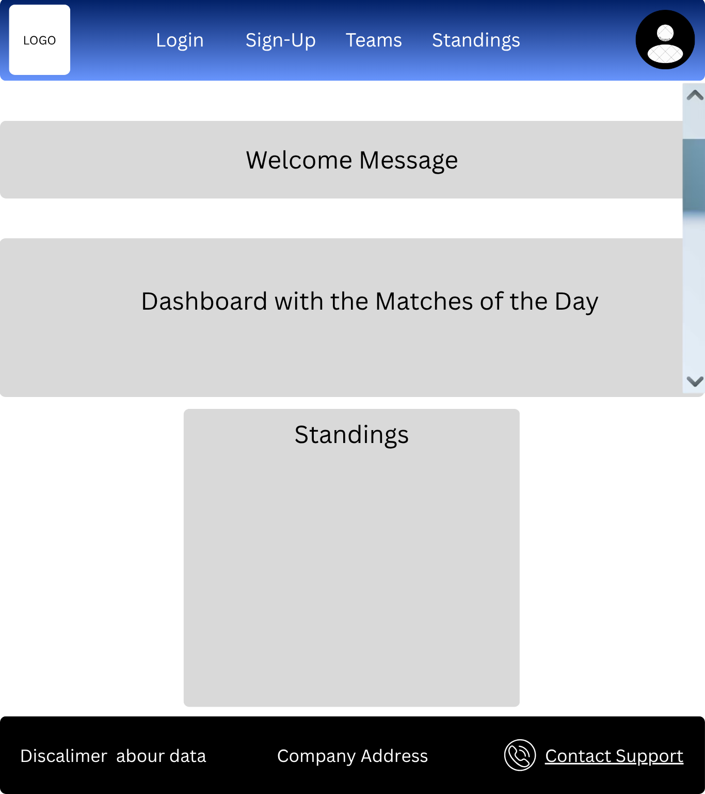
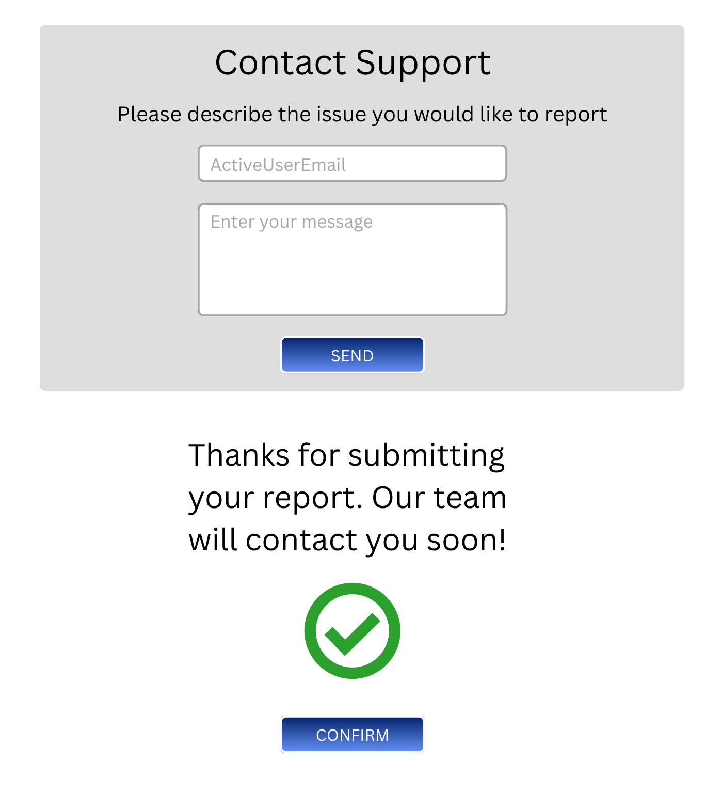
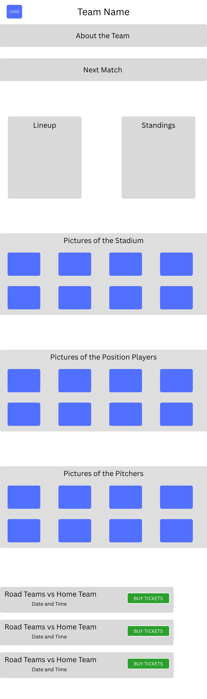

# 2025-MyMLB

## ✍️ Author and Tutor Information
This web application was developed as a final degree project in Computer Engineering at the Rey Juan Carlos University, within the Higher Technical School of Computer Engineering (ETSII), in Madrid, Spain.

<table>
  <thead>
    <th>Name</th>
    <th>Role</th>
    <th>University Account</th>
    <th>GitHub Account</th>
  </thead>
  <tbody>
    <tr>
      <td>Alfonso Rodríguez Gutt</td>
      <td>Student (Author)</td>
      <td>a.rodriguezgu.2022@alumnos.urjc.es</td>
      <td>AlfonsoRodr</td>
    </tr>
    <tr>
      <td>Iván Chicano Capelo</td>
      <td>Tutor</td>
      <td>ivan.chicano@urjc.es</td>
      <td>ivchicano</td>
    </tr>
  </tbody>
</table>

## 🧾 Table of Contents
- [Application Functionality](#-application-functionality)
- [Methodology](#-methodology)
  - [Phase 1: Features and Screens Specification](#phase-1-features-and-screens-specification)
  - [Phase 2: Repository, Tests and CI](#phase-2-repository-tests-and-ci)
  - [Phase 3: Version 0.1 - Basic Features and Docker](#phase-3-version-01---basic-features-and-docker)
  - [Phase 4: Version 0.2 - Intermediate Features](#phase-4-version-02---intermediate-features)
  - [Phase 5: Version 1.0 - Advanced Features](#phase-5-version-10---advanced-features)
  - [Phase 6: Report](#phase-6-report)
  - [Phase 7: Defense of the Final Degree Project](#phase-7-defense-of-the-final-degree-project)
- [Objectives](#-objectives)
  - [Functionals](#functionals)
  - [Technicals](#technicals)
- [Entities](#-entities)
- [Relations Between Entities](#-relations-between-entities)
- [Types of Users and Browsing Permissions](#-type-of-users-and-browsing-permissions)
- [Entities with Images](#-entities-with-images)
- [Charts](#-charts)
- [User Stories](#-user-stories)
  - [User Register](#user-register)
  - [See Application General Information](#see-application-general-information)
  - [User Login](#user-login)
  - [User Logout](#user-logout)
  - [Delete Account](#delete-account)
  - [Add Favourite Team](#add-favourite-team)
  - [Remove Favourite Team](#remove-favourite-team)
  - [Edit Profile Settings](#edit-profile-settings)
  - [Ticket Purchase](#ticket-purchase)
  - [Cancel Ticket Purchase](#cancel-ticket-purchase)
  - [Notifications via Email](#notifications-via-email)
  - [Contact Support via Email](#contact-support-via-email)
  - [Update Team Information](#update-team-information)
  - [Edit Player Information](#edit-player-information)
  - [Edit Stadium Information](#edit-stadium-information)
  - [Edit Ticket](#edit-ticket)
  - [Create and Edit a Game](#create-and-edit-a-game)
  - [Update Game Score](#update-game-score)
  - [User´s Favourite Teams Statistics](#users-favourite-teams-statistics)
  - [Ticket Selling per Team Statistics](#ticket-selling-per-team-statistics)
- [Page Layouts and Navigation](#-page-layouts-and-navigation)
  - [1: Login, Registration and Password Recovery](#1-login-registration-and-password-recovery)
  - [2: Headers](#2-headers)
  - [3: Footer](#3-footer)
  - [4: Home](#4-home)
  - [5: Teams](#5-teams)
  - [6: Standings](#6-standings)
  - [7: Profile](#7-profile)
  - [8: My Tickets](#8-my-tickets)
  - [9: Favourite Teams](#9-favourite-teams)
  - [10: Ticket Selection](#10-ticket-selection)
  - [11: Ticket Purchase](#11-ticket-purchase)
  - [12: Contact Support](#12-contact-support)
  - [13: Team Information](#13-team-information)
  - [14: Player Information](#14-player-information)
  - [15: Edit Menu](#15-edit-menu)
  - [16: Create Match](#16-create-match)
  - [17: Matches](#17-matches)
  - [18: Update Scoreboard](#18-update-scoreboard)
  - [19: Statistics](#19-statistics)

## ⚾ Application Functionality
The app is a portal dedicated to Major League Baseball (MLB), offering general league information, as well as detailed information on teams, players, standings, and other relevant aspects.

In addition to these basic functions, users can register to access exclusive features, such as purchasing tickets for their favorite games, selecting favorite teams to customize the information displayed, and the ability to enable or disable email notifications with the latest league news from their profile.

The platform also has administrator users, responsible for the internal management of the app, including updating information on teams, players, and other content.

The main objective of this app is to offer baseball fans a comprehensive and up-to-date space to follow MLB and the performance of their favorite teams throughout the season.

At this time, the functional and technical objectives are only defined but not implemented.

## 📝 Methodology
The development of the application will be divided in different phases, which are:

### Phase 1: Features and Screens Specification
**Start Date:** June 26

**Due Date:** September 15

**Real End Date:** TBD

The application features will be defined and categorized as basic, intermediate, or advanced. Alongside this, an initial overview of the screens will be provided, specifying their purpose, transitions, and navigation flow. 

Additionally, the entities and their relationships will be defined, as well as the different user types and their corresponding permissions within the application.

### Phase 2: Repository, Tests and CI
**Start Date:** TBD

**Due Date:** October 15

**Real End Date:** TBD

In this phase, the repository will be created along with the basic implementation required to connect the client, the server and the database. Furthermore, the first automated tests will be implemented and the Continous Integration (CI) system will be configured.

### Phase 3: Version 0.1 - Basic Features and Docker
**Start Date:** TBD

**Due Date:** December 15

**Real End Date:** TBD

The basic features will be implemented along with their corresponding automated tests, and the application will be packaged using Docker (adding Continous Delivery). Finally, the 0.1 version will be released.

This phase will follow an **iterative and incremental development process**, meaning that the application will be built in small parts or increments, with features gradually added until the application is complete. Each increment will be reviewed and refined through successive iterations.

>[!NOTE]
> This process will also be followed in phases 4 through 5.

### Phase 4: Version 0.2 - Intermediate Features
**Start Date:** TBD

**Due Date:** March 1

**Real End Date:** TBD

The intermediate features will be implemented along with their corresponding automated tests, and the application will also be packaged. Finally, the 0.2 version will be released.

### Phase 5: Version 1.0 - Advanced Features
**Start Date:** TBD

**Due Date:** April 15

**Real End Date:** TBD

The advanced features will be implemented along with their corresponding automated tests, and the application will also be packaged. At this stage, the application will be complete and the 1.0 version will be released.

### Phase 6: Report
**Start Date:** TBD

**Due Date:** May 15

**Real End Date:** TBD

The first draft of the report will be prepared.

### Phase 7: Defense of the Final Degree Project
**Start Date:** TBD

**Due Date:** June 15

**Real End Date:** TBD

The defense of the Final Degree Project will take place.

Below is a **Gantt Chart** that graphically reflects the planning mentioned above.

## 🎯 Objectives

### Functionals
The main functional objective of this application is to offer baseball fans a complete and personalized portal for Major League Baseball (MLB), allowing them to have access to general league information, team and player data, standings and match results, as well as access interactive services such as purchasing tickets, personalizing content based on favorite teams, and allow the user to stay up to date on the latest that is happening around league by enabling email notifications.

#### Main Features
1. Display general MLB information, including standings and match results.
2. Display teams and players information.
3. Allow the users to sign-up and authenticate themselves to have access to exclusive services.
4. Allow the registered users to mark a team as a favourite.

> [!NOTE]
> In the [User Stories](#-user-stories) section you can find all of the features the application will provide.

### Technicals
The application will be developed as a web platform with a client-server architecture using the **HTTPS** protocol to ensure application security, data protection, and secure communication. 

The **backend** will be implemented with **Spring Boot** to manage the business logic, communication with the **MySQL database**, and the exposure of services through a REST API. 

The **frontend** will be implemented with **HTML, CSS (it`s being considered to use TailwindCSS), JavaScript, and Angular**, offering a responsive interface. The **ng2-charts** library will be integrated to display statistical data (charts).

**Postman** will be used during the development and testing of REST services, and the workflow will include version control with **Git**. Additionally, **Docker** will be used as part of the Continuous Integration (CI), Continuous Delivery (CD), and Continuous Deployment processes, ensuring that the application can be built, packaged, tested, and deployed consistently across different environments. 

To ensure the software quality, unit and integration testing will be performed using **Mockito** and **AssertJ**, as well as system/end-to-end (e2e) testing using **Selenium**.

#### Main Technical Features
1. Spring Boot as the backend framework to implement the business logic and expose the REST API.
2. HTML, CSS (it`s being considered to use TailwindCSS), JavaScript and Angular to implement the frontend, ensuring a responsive interface.
3. ng2-charts library to display the statistical data (charts).
4. Data storage and management using a MySQL relational database.
5. Postman for designing and validating REST API endpoints.
6. Responsive design to ensure compatibility with mobile devices, tablets and computers.
7. Version control with Git.
8. Docker for application containerization as part of the Continuous Integration (CI), Continuous Delivery (CD), and Continuous Deployment process.
9. Mockito and AssertJ for unit and integration testing.
10. Selenium for system/end-to-end (e2e) testing.

## 🧠 Entities
- User
- Team
- Stadium
- Player
- Game
- Ticket
- PasswordResetToken

> [!IMPORTANT]
> The `PaswordResetToken` entity will be used to give the user an opportunity to create a new password (in case the user have forgotten the previous one, and clicks the "Forgot My Password" option).

## 🪢 Relations between Entities
### 🙍 User
<table>
  <thead>
    <th>Related with...</th>
    <th>Cardinality</th>
  </thead>
  <tbody>
    <tr>
      <td>Team</td>
      <td>1..N</td>
    </tr>
    <tr>
      <td>Ticket</td>
      <td>1..N</td>
    </tr>
    <tr>
      <td>PasswordResetToken</td>
      <td>1..1</td>
    </tr>
  </tbody>
</table>

### ⚾ Team
<table>
  <thead>
    <th>Related with...</th>
    <th>Cardinality</th>
  </thead>
  <tbody>
    <tr>
      <td>User</td>
      <td>N..1</td>
    </tr>
    <tr>
      <td>Player</td>
      <td>1..N</td>
    </tr>
    <tr>
      <td>Stadium</td>
      <td>1..1</td>
    </tr>
    <tr>
      <td>Game</td>
      <td>1..N</td>
    </tr>
  </tbody>
</table>

### 🏃 Player
<table>
  <thead>
    <th>Related with...</th>
    <th>Cardinality</th>
  </thead>
  <tbody>
    <tr>
      <td>Team</td>
      <td>1..1</td>
    </tr>
  </tbody>
</table>

### 🏟️ Stadium
<table>
  <thead>
    <th>Related with...</th>
    <th>Cardinality</th>
  </thead>
  <tbody>
    <tr>
      <td>Team</td>
      <td>1..1</td>
    </tr>
    <tr>
      <td>Game</td>
      <td>1..N</td>
    </tr>
  </tbody>
</table>

### 🆚 Game
<table>
  <thead>
    <th>Related with...</th>
    <th>Cardinality</th>
  </thead>
  <tbody>
    <tr>
      <td>Team</td>
      <td>N..1</td>
    </tr>
    <tr>
      <td>Ticket</td>
      <td>1..N</td>
    </tr>
    <tr>
      <td>Stadium</td>
      <td>N..1</td>
    </tr>
  </tbody>
</table>

### 🎟️ Ticket
<table>
  <thead>
    <th>Related with...</th>
    <th>Cardinality</th>
  </thead>
  <tbody>
    <tr>
      <td>User</td>
      <td>N..1</td>
    </tr>
    <tr>
      <td>Game</td>
      <td>N..1</td>
    </tr>
  </tbody>
</table>

### 🔐 PasswordResetToken
<table>
  <thead>
    <th>Related with...</th>
    <th>Cardinality</th>
  </thead>
  <tbody>
    <tr>
      <td>User</td>
      <td>1..1</td>
    </tr>
</table>

## 🔒 Type of Users and Browsing Permissions
### 🕵️‍♂️ Anonymous User
- See the general information provided by the application.

### 🧑‍💻 Registered User
- See both general and personalized information provided by the application.
- Access its profile settings.
- Delete Account.
- Add/Remove a team from the favourite list.
- Buy tickets for a game.
- Cancel ticket purchase.
- Receive notifications via email.
- Contact support via email.

### 🔑 Administrator (Admin)
- Update team information.
- Edit player information.
- Edit stadium information.
- Add/Modify tickets.
- Create and Edit a Game.
- Update Game score.
- User´s favourite teams statistics.
- Ticket selling per team statistics.

## 📷 Entities with Images
- User
- Team
- Stadium
- Player

## 📊 Charts
<table>
  <thead>
    <th>Chart Topic</th>
    <th>Type of Chart</th>
  </thead>
  <tbody>
    <tr>
      <td>Standings (Dynamic)</td>
      <td>Table</td>
    </tr>
    <tr>
      <td>Last 10 Games of a Team</td>
      <td>Line</td>
    </tr>
    <tr>
      <td>Ticket Selling for Each Team</td>
      <td>Bar</td>
    </tr>
    <tr>
      <td>User´s Favourite Teams</td>
      <td>Horizontal Bar</td>
    </tr>
  </tbody>
</table>

> [!NOTE]
> The information described above is subject to change. Both the chart types and topics may be updated as needed.

### 📚 Library To Use
Since the front-end will be develop using `Angular`, the library chosen for creating all the charts will be `ng2-charts`, which is a wrapper for the popular chart library `Chart.js`.

## 👤 User Stories

### User Register
**As a:** Anonymous User.

**I want to:** Create an account in the web application.

**So that:** I can access exclusive features, such as buying tickets for a game.

**Feature Type:** Basic.

#### Acceptance Criteria
- The registration form must ask for:
  - Full name (first and last name).
  - Password.
  - Email.
- The email must be unique.

#### Dependencies
- The user must not already exists in the application`s database.

#### Tests
- Verify that the entered email by the user does not exist before allowing the registration.
- Attempting to register an user that already exist, should show an error message.

<!-- ------------------------------------------------ See Application General Information ------------------------------- -->
### See Application General Information
**As a:** Anonymous User.

**I want to:** See the general information of the application.

**So that:** I can inform myself about every team in the league.

**Feature Type:** Basic.

#### Acceptance Criteria
- This information must be accesible without login.
- It must be displayed on the main page (Home).
- The home page must include an option to sign in/sign up.
- The standings for each league and division must be correctly displayed.
- The news around the league must be correctly displayed (TBD).
- A dropdown menu listing every team in the league must be available for the user.
- Selecting a team must redirect to that team´s detailed view.

#### Tests
- Verify that the home page is accessible without authentication.
- Verify that the standings are correctly displayed.
- Verify that selecting a team displays correctly its detailed information.
- Verify that the news around the league are correctly displayed (TBD).
- Verify that selecting the sign in/sign up option redirects to the login/register page.
- Attempting to purchase a ticket for any game should redirect to the login/register page.

<!-- ------------------------------------------------ Login ------------------------------- -->
### User Login
**As a:** Registered User.

**I want to:** Log into my account.

**So that:** I can access my personal dashboard and features.

**Feature Type:** Basic.

#### Acceptance Criteria
- The login form must ask for:
  - Email.
  - Password.
- If the credentials are valid, the user is redirected to the main page.
- If the credentials are invalid, an error message is displayed.
- A "Recover my Password" option is available via email.

#### Dependencies
- The user must be register in the application´s database.

#### Tests
- Verify that the entered email and password are both correct.
- Attempting to log in with an user that does not exists, should show an error message.
- If the user selects the "Recover my Password" option; verify that the recovery email is sent successfully.

<!-- ------------------------------------------------ Log out ------------------------------- -->
### User Logout
**As a:** Registered User.

**I want to:** Log out from my account.

**So that:** I can close my session and switch to another account.

**Feature Type:** Basic.

#### Acceptance Criteria
- The user´s data must not be deleted during the log out process.
- The current session must be properly terminated.
- The user must be redirected to the login/register page.

#### Dependencies
- The system must have session/token management implemented.

#### Tests
- Verify that the user´s account still exists in the database after logging out.
- Verify that the user is redirected to the login/register page once the session is closed.
- Verify that accessing a restricted page once the session is closed, instantly redirects to the login/register page.

<!-- ------------------------------------------------ Delete Account ------------------------------- -->
### Delete Account
**As a:** Registered User.

**I want to:** Delete my account from the application.

**So that:** I can remove all my personal data and stop using the application services.

**Feature Type:** Intermediate.

#### Acceptance Criteria
- The "delete account" option is available from the user account settings.
- The user must confirm the action.
- Once confirmed, all the account´s data will be permanently remove from the application.

#### Dependencies
- The user must be logged in to access its account settings.
- All associated data (e.g., tickest) must be dettach from that account.

#### Tests
- Verify that the delete option is only visible to registered user.
- Verify that the deletion process removes all of the user related data from the database.
- Verify that attempting to log in with deleted credentials returns an error message.

<!-- ------------------------------------------------ Add favourite team ------------------------------- -->
### Add Favourite Team
**As a:** Registered User.

**I want to:** Select a team as my "favourite".

**So that:** I can personalized the information that the application provides me.

**Feature Type:** Basic.

#### Acceptance Criteria
- The selected team must not already be in the list of favourites.
- The number of favourites team must not exceed the maximun allowed (3 (can change)).

#### Tests
- Verify that a user cannot add the same team more than once to their favourites.
- Verify that adding a team beyond the allowed limit is prevented and shows a proper message.
- Verify that favourite teams are stored correctly and can be retrieved/displayed.

<!-- ------------------------------------------------ Remove Fav Team ------------------------------- -->
### Remove Favourite Team
**As a:** Registered User.

**I want to:** Remove a team as my "favourite".

**So that:** I can udpate my preferences.

**Feature Type:** Basic.

#### Acceptance Criteria
- The current ammount of favourite teams that exists on the list, must be updated.
- After removal, the user can add a new favourite team.
- A confirmation message may be shwown before the removal (TBD).

#### Dependencies
- The team must be currently present in the user´s list.

#### Tests
- Verify that a team can be removed from the list of favourites.
- Verify if the list is correctly updated after the removal.
- Verify that removing a favourite allows a new one to be added within the limit.

<!-- ------------------------------------------------ Edit Profile Settings ------------------------------- -->
### Edit Profile Settings
**As a:** Registered User.

**I want to:** Edit my account settings.

**So that:** I personalize my personal settings.

**Feature Type:** Intermediate.

#### Acceptance Criteria
- The user must be able to edit the following fields:
  - Username.
  - Password.
  - Profile Picture.
  - Favourite Team(s).
- A confirmation message should appear before completing the operation.
- A success message should be displayed after the operation completes successfully.

#### Dependencies
- The new password must be different from the current one.
- The list of favourite teams must comply the defined requirements.

#### Tests
- Verify that profile changes are saved correctly in the database.
- Verify that any invalid input should thrown an error message.
- Verify that after saving, the new settings is correctly shown to the user.

<!-- ------------------------------------------------ Ticket Purchase ------------------------------- -->
### Ticket Purchase
**As a:** Registered User.

**I want to:** Purchase ticket(s).

**So that:** I can attend matches played by my favourite teams.

**Feature Type:** Intermediate.

#### Acceptance Criteria
- The user must complete the purchase form with valid inputs.
- A success message should be displayed once the operation is successfully completed.
- If any error occur, an error message should inform the user of the issue.
- After the purchase, the ticket(s) must be registered under its respective user (ticket list).
- After the purchase, the tickets should appear in "My Tickets", within the user´s account settings.
- The system must handle any oncurrency problems that might occur during the purchase process.

#### Dependencies
- The number of tickets requested must be less or equal to the number of tickets available.

#### Tests
- Verify that the user can purchase a ticket with a valid input.
- Verify that attempting to purchase more tickets than are available results in an error.
- Verify that a success message appear afte the purchase.
- Verify that the ticket(s) are saved in the user`s ticket list after the purchase.
- Verify that the ticket(s) purchased appear in the "My Tickets" section after the purchase.
- Verify that the total number of available tickets for the respective type is updated correctly in the database after the purchase.

<!-- ------------------------------------------------ Cancel Ticket Purchase ------------------------------- -->
### Cancel Ticket Purchase
**As a:** Registered User.

**I want to:** Cancel my ticket purchase.

**So that:** I can undo the operation if I change my mind.

**Feature Type:** Intermediate.

#### Acceptance Criteria
- The cancellation option must be available to the user after selecting the ticket quantity.
- Undoing the purchase of any ticket must not register any ticket under the respective user.
- After the operation, a success message must be displayed.
- The ammount of ticket of the selected type must restore accordingly.
- The system must handle any oncurrency problems that might occur during the cancellation.

#### Dependencies
- The cancellation must happen before the purchase is confirmed.

#### Tests
- Verify that the ammount of tickets previously selected is never registered under the respective user.
- Verify that the ammount of available tickets of the selected type is correctly restored.
- Verify that after the operation is successfully completed, a success message is displayed.

<!-- ------------------------------------------------ Notifications ------------------------------- -->
### Notifications via Email
**As a:** Registered User.

**I want to:** Receive notifications from the apllication via email.

**So that:** I can be notified about importan events like tickets on sale, upcoming match dates, profile changes, etc.

**Feature Type:** Intermediate.

#### Acceptance Criteria
- The user must be able to enable or disable email notifications from their settings.
- The notifications are sent only if the user enabled them.
- The notifications must cover important events/actions such as: purchase confirmation, change in any of the personal settings, etc.

#### Dependencies
- User preferences for notifications must be stored and accessible.

#### Tests
- Verify that emails are sent correctly when the notifications are enabled.
- Verify that no emails are sent when the notifications are disabled.
- Verify that the changes in the notifications preferences are correctly updated and stores.

<!-- ------------------------------------------------ Contact Support ------------------------------- -->
### Contact Support via Email
**As a:** Registered User.

**I want to:** Send a message to report a problem or asking for support.

**So that:** I can get help regarding the issue from the application´s administrators.

**Feature Type:** Intermediate.

#### Acceptance Criteria
- The user can fill out a contact form with the following fields:
  - User´s email.
  - Subject.
  - Body.
- The message must be sent to the application´s administrators via email.
- A confirmation message must be displayed to the user after a successfull submission.  

#### Tests
- Verify that the contact form send the message correctly.
- Verify that the confirmation message is correctly displays.
- Verify that error messages appears when the required fields are empty or invalid.

<!-- ------------------------------------------------ Update Team Information ------------------------------- -->
### Update Team Information
**As a:** Admin.

**I want to:** Update the editable team information.

**So that:** The team´s data remains up to date.

**Feature Type:** Basic.

#### Acceptance Criteria
- An admin-only section must be available for this operation.
- The admin must be able to edit the following fields:
  - Number of Wins.
  - Number of Losses.
- All other team stats must be automatically calculated based on the previously mentioned stats.
- Once the information has been updated, a success message must be displayed.
- Every quantity (except the run differential) must be a positive number.
- The team`s position in the standings must be updated automatically based on the new data.

#### Dependencies
- The team must already exists in the database.

#### Tests
- Verify that this section is only visible to admins.
- Verify that the updated number of wins/losses of a team is correctly saved in the database.
- Verify that the total number of games played by a team is correctly calculated.
- Verify that the win percentage of a team is correctly calculated.
- Verify that the games behind (if its not in the first position) of a team is correctly calculated.
- Verify that the run differential is correctly calculated.
- Verify that the team´s position within its division is correctly updated.
- Verify that the success message is correctly displayed.
- Verify that entering invalid values triggers an error message.

<!-- ------------------------------------------------ Edit Player Information ------------------------------- -->
### Edit Player Information
**As a:** Admin.

**I want to:** Edit the player information.

**So that:** The player`s data can be updated whenever is needed.

**Feature Type:** Basic.

#### Acceptance Criteria
- An admin-only section must be available for this operation.
- The admin must be able to edit the following fields:
  - Player Picture.
  - Team he plays.
  - Position he plays.
  - Total At Bats (AB).
  - Number of Hits (H).
  - Number of Run Batted In (RBI).
  - Number of Home Runs (HR).
- The Batting Average (Avg) must be automatically calculated from AB and H.
- Once is finished, a success message must be displayed.
- Every numeric value must be positive.
- In case the player change teams, the new team must be a valid one (exists in the database).
- In case the player change position, the new position must be a valid one (exists in the database).

#### Dependencies
- The player must already exists in the database.
- The new team must exist in the database.
- The new position must be a valid one.

#### Tests
- Verify that this section is only visible to admins.
- Verify that the new player´s picture is correctly saved in the database.
- Verify that the new player´s team is correctly reflected in the player´s profile.
- Verify that the new team correctly registers the new player in its roster.
- Verify that the total ammount of ABs a player have are correctly updated.
- Verify that the ammount of Hits of a player are correctly updated.
- Verify that the ammount of RBIs are correctly updated.
- Verify that the ammount of HR are correctly updated.
- Verify that the Batting Avg is correctly calculated.
- Verify that entering invalid values triggers an error message.
- Verify that entering a non valid team triggers an error message.
- Verify thah entering a non valid position triggers an error message.
- Verify that a success message is displayed after a successfull operation.

<!-- ------------------------------------------------ Edit Stadium Information ------------------------------- -->
### Edit Stadium Information
**As a:** Admin.

**I want to:** Edit the stadium information.

**So that:** The stadium`s data can be updated whenever is needed.

**Feature Type:** Basic.

#### Acceptance Criteria
- An admin-only section must be available for this operation.
- The admin must be able to edit the following fields:
  - Stadium Picture.
- Once is finished, a success message must be displayed.

#### Dependencies
- The stadium must already exists in the database.

#### Tests
- Verify that this section is only visible to admins.
- Verify that the new stadium´s picture is correctly saved in the database.
- Verify that the success message is correctly displayed once the operation is completed.

<!-- ------------------------------------------------ Edit Ticket ------------------------------- -->
### Edit Ticket
>  [!WARNING]
> This feature might change, it is not completely guaranteed that it will be implemented.

**As a:** Admin.

**I want to:** Edit the tickets information.

**So that:** The ticket`s data can be modified whenever is needed.

#### Acceptance Criteria
- An admin-only section must be available for this operation.
- The admin must be able to edit the following fields:
  - Type.
  - Price.
  - Date or time.
  - Status (Active or Inactive).
- A sucess message must be displayed after a sucessfull update.
- The price must be a positive number.

#### Dependencies
- The ticket must already exists in the system.
- The associated user or stadium must remain untouchable.

#### Tests
- Verify that this section is only visible to admins.
- Verify that invalid values displays an error message.
- Verify that the updated information is correctly reflected.
- Verify that a sucess message appears after a sucessfull operation.
- Verify that the updated information persist in the database.
- Verify that the price is a valid value.
- Verify that if any field have an invalid value, an error message is displayed.
- Verify that inactive tickets no longer appears on the user´s ticket list or in the public purchase view.

<!-- ------------------------------------------------ Create and Edit a Game ------------------------------- -->
### Create and Edit a Game
**As a:** Admin.

**I want to:** Create and Edit a match.

**So that:** A match is establish between two teams, and modify any information if needed.

**Feature Type:** Advanced.

#### Acceptance Criteria
- An admin-only section must be available for this operation.
- The administrator must be able to create a game by selecting:
  - Home Team.
  - Away Team.
  - Date and Time.
  - Stadium.
- A team cannot play again itself.
- The stadium must be the one of the Home Team.
- A success message must appear after the operation.

#### Dependencies
- A game must not overlap in schedule with another game at the same stadium.

#### Tests
- Verify that this section is only visible to admins.
- Verify that a game can be created successfully.
- Verify that a success message appears after a successfull operation.
- Verify that an error message appears when attempting to create a game with invalid data.
- Verify that a game cannot be created in a stadium that is already booked at the same time.
- Verify that the stadium the game is being held, is the Home Team stadium.
- Verify that the updated data is correctly stored.

<!-- ------------------------------------------------ Update Game Score ------------------------------- -->
### Update Game Score
**As a:** Admin.

**I want to:** Update the score and inning of the game.

**So that:** I can keep the game information up to date.

**Feature Type:** Advanced.

#### Acceptance Criteria
- An admin-only section must be available for this operation.
- The administrator must be able to update the following fields:
  - Runs scored by home and away teams.
  - Current inning.
  - Game status (Scheduled, In Progress, Finished).
- Scores and innings must be positive integers.
- The game status can only progress forwards (ej: Not going back from "In Progress" to "Scheduled").

#### Dependencies
- The game must exists.
- The game must already started (the current date is the same or later than the scheduled date).  

#### Tests
- Verify that this section is only visible to admins.
- Verify that the score and inning are correctly updated.
- Verify that the score and inning are valid inputs.
- Verify that an invalid input triggers an error message.
- Verify that the transition of the status are valid (forwards).

<!-- ------------------------------------------------ User´s favourite teams statistics ------------------------------- -->
### User´s Favourite Teams Statistics
**As a:** Admin.

**I want to:** See the statistics about which teams are most frequently selected as "favourite" for the users.

**So that:** I can identify which teams are the most beloved according to the users.

**Feature Type:** Advanced.

#### Acceptance Criteria
- An admin-only section must be available to display this data.
- The data will be display through a horizontal bar chart.
- The chart must update dynamically based on the user´s preferences.

#### Tests
- Verify that this section is only visible to admins.
- Verify that the data updates when the users modify their favoruite teams.

<!-- ------------------------------------------------ Ticket Selling per Team Statistics ------------------------------- -->
### Ticket Selling per Team Statistics
**As a:** Admin.

**I want to:** See the statistics about which teams have sold the most tickets.

**So that:** I can identify which teams are the most entertaining and interesting to watch according to the users.

**Feature Type:** Advanced.

#### Acceptance Criteria
- An admin-only section must be available to display this data.
- The data will be display through a bar chart.
- The chart must update dynamically as ticket sales occur.

#### Tests
- Verify that this section is only visible to admins.
- Verify that the data updates when the users purchases tickets.

## 🔀 Page Layouts and Navigation

> [!WARNING]
> The drafts that are shown below may look a bit plain, as their purpose is to show the structure of each page and how the main elements will be displayed. As you can see, the background and the images are not shown in this draft, and the color tones shown in certain elements are not definitve. These will be refinede using CSS to achieve the desired look.

### 1: Login, Registration and Password Recovery

A classic login form where the user, in order to access the application, must enter their username and password. In case the user has forgotten their password, they can establish a new one by clicking the "Forgot Your Password?" link. If the user does not have an account, they have the option to create one by clicking the "SIGN UP" button, which redirects them to the registration form.

A classic registration form where the user, in order to create an account, must enter a username, email and password. If everything goes well, the success message will be displayed. In case the user already has an account, they can go to the login form by clicking the "SIGN IN" button.

As you can see, these forms are very similar, with the main difference being that the blue panel switches sides depending on the form (left or right). When the user switches between the sign-in and sign-up forms, this change is displayed as an animation, where the blue panel smoothly slides to the opposite side while the form panel moves accordingly.

These pages will be displayed sequentially on the same screen, with transitions between each step. In the first layout, the user will need to enter their email address to receive a verification code. After clicking 'SEND', the user will enter this code, and finally, in the last layout, they will set a new password. If everything is successful, a confirmation message will be shown, and the user will be able to log in to their account with the new password.

### 2: Headers

Depending on the type of user, a different header will displayed. These headers are:
#### Anonymous User:
- **Login:** Redirects the user to the login form, allowing them to access the exclusive features the application provide.
- **Sign-Up:** Redirects the user to the registration form, allowing them to create an account.
- **Teams:** Displays a list of all the teams in the league. By clicking on any of them, the user can view detailed information about that team.
- **Standings:** Redirects the user to the [Standings Page](#6-standings), where all the standings for the different leagues and divisions are shown.
- **Profile Icon:** Redirects the user to the [Login Form](#1-login-registration-and-password-recovery).

#### Registered User:
- **My Tickets:** Redirects the user to a page where all the tickets they have purchased are displayed.
- **Fav Teams:** Redirects the user to a page dipslaying all the teams they have selected as favourites.
- **Teams:** Displays a list of all the teams in the league. By clicking on any of them, the user can view detailed information about that team.
- **Standings:** Redirects the user to the [Standings Page](#6-standings), where all the standings for the different leagues and divisions are shown.
- **Profile Icon:** Redirects the user to the [Profile Settings Page](#7-profile), where all the user`s data is displayed and can be edited.

#### Admin User:
- **Edit Info:** Redirects the admin to the [Edit Menu](#15-edit-menu), where they can search for the team, player or stadium they want to edit.
- **Matches:** Redirects the admin to the [Matches Page](#18-matches), where the matches of the day are displayed and the admin can select a match to edit.
- **Create Match:** Redirects the admin to the [Create Match Form](#16-create-match).
- **Statistics:** Redirects the admin to the [Statistics Page](#19-statistics), where the admin can see the statistical data of **"User´s Favourite Teams"** and **"Ticket Selling per Teams"** reflected graphically.
- **Profile Icon:** Redirects the user to the [Profile Settings Page](#7-profile), where all the user`s data is displayed and can be edited.

> [!NOTE]
> To avoid repetition, the headers are not shown on every page of the draft. However, this does not mean that these pages will be without headers in the final design.

### 3: Footer

The footer shows the following information:
- **Disclaimer:** Here there will be a brief paragraph stating that the information displayed in the application about teams, players and stadiums, is obtained from official MLB data.
- **Address:** Address from which the application has been developed (in this case, the university`s address will appear).
- **Contact Support:** Is a link that will redirect the user to the [Contact Support Form](#12-contact-support), in case the user has any problems while using of the application.

> [!NOTE]
> To avoid repetition, the footer is not shown on every page of the draft. However, this does not mean that these pages will be without footer in the final design.

### 4: Home

In the home page, a welcome message will greet the user, following this, a dashboard with all the games that will take place throught a current day will be displayed. Finally, the standings of both leagues and the divisions will be displayed, this standings of the different divisions will rotate, showing the user in the form of a slide every x seconds, or the user will manually go through them with arrows that will appear (it is still being decided how this display will be done).

If the registered user has selected favourite teams, the divisions that will appear first will be those in which those teams are part of.
### 5: Teams

When clicking **"Teams"** in the [headers](#2-headers), the home page will become slightly opaque and a panel will appear in the center of the page, displaying a list of all the MLB teams. By clicking on any of them, the user will be redirected to the [Team Information Page](#13-team-information).

### 6: Standings

When clicking **"Standings"** in the [headers](#2-headers), the user will be redirected to this page, where the MLB standings are displayed. The standings are divided into two leagues: the American and the National League. Each of them consists of three divisions: East, Central and West. Aditionally, each team is displayed alongside its respective logo.

### 7: Profile

On this page, the user can view the personal data used in the application. Aditionally, they can personalize their account by editing the following fields:
- Username
- Password
- Enable/Disable notifications

Furthermore, the user has the option to log out or delete their account by clicking on the respective buttons. After that, the corresponding confirmation layout will appear, centered on the same page, with the background becoming slightly opaque.

### 8: My Tickets

When clicking **"My Tickets"** in the [headers](#2-headers), the user will be redirected to this page, displaying all the purchased ticket by the user.

The tickets are displayed in a two-sided card layout. The front side shows an image (common for all tickets), while the back side reveals the ticket information such as the match, the stadium where it will held, and the date and time. This rotation will happen when the user hovers over the ticket.

### 9: Favourite Teams

When clicking **"Fav Teams"** in the [headers](#2-headers), the user will be redirected to this page, displaying all the teams marked as favourite. Each team includes a button to remove it from the favourite list.

### 10: Ticket Selection

### 11: Ticket Purchase

Once the user has confirmed the ticket selection, they will be redirected to this page, where they must enter a credit card information to complete the pruchase of the ticket(s). The user also have the option to cancel the purchase at any time.

### 12: Contact Support

By clicking the **Contact Support** link in the [footer](#3-footer), the user will be redirected to this form where they can report the issue to the application administrators.

### 13: Team Information

The team´s page will display the following information about the corresponding team:
- **About the Team:** A brief paragraph on the team’s history.
- **Next Match:** The next match that the team will play.
- **Lineup:** The current lineup used by the team.
- **Standings:** Displays the division in which the team competes.
- **Pictures of the Stadium:** Displays a carousel of photos of the team's stadium.
- **Pictures of the Position Players:** Displays a carousel of photos of the position players.
- **Pictures of the Pitchers:** Displays a carousel of photos of the pitchers.
- **Upcoming Matches:** Displays a list of upcoming home games, with the option to purchase tickets for any of these games.

If the user clicks on a picture of any of the players (position players and pitchers), they will be redirected to the [Player Information Page](#14-player-information).

### 14: Player Information

When the user clicks on a player's photo on the [team page](#13-team-information), the page background will become slightly opaque and the player's image will display in the center of the page, with a table of that player's stats displayed below. The stats shown will vary depending on whether the selected player is a position player or a pitcher (as illustrated in the sketch).

### 15: Edit Menu

When the admin clicks on [Edit Info](#2-headers), they will be redirected to this page, where they can search for a team, player, or stadium to edit. After selecting the entity, an specific form to that entity will appear. In these forms, the admin can edit any information they wish.

> [!NOTE]
> In the player´s form, the admin will be able to edit the following fields:
> - Picture.
> - Team.
> - Position.
> - Total At Bats (AB).
> - Number of Hits (H).
> - Numbers of Runs Batted In (RBI)
> - Number of Home Runs (HR)
>
> This last two, despite not being showed in the draft, will appear in the final design (hence the **"..."**)

> [!NOTE]
> In the team´s form, the stadium cannot be edited, therefore, only the stadium’s name is shown. The same applies in the stadium´s form with its respective team.

### 16: Create Match

When the admin clicks on [Create Match](#2-headers), they will be redirected to this page, where they can create a match by filling out the form.

### 17: Matches

When the admin clicks on [Matches](#2-headers), they will be redirected to this page, where all the matches scheduled for a specific date will be displayed. Additionally, if the admin clicks on the "UPDATE" button next to any match, they will be given the option to update the scoreboard of that match by being redirected to the [Update Scoreboard Page](#18-update-scoreboard)

### 18: Update Scoreboard

In this page, the admin will have basic form that allows them to update any of the available fields for the selected match.

As a reminder, the **status** has only three possible values:
- **Scheduled:** The match has not started.
- **In Progress:** The match has already started.
- **Finished:** The match is over.

### 19: Statistics

When the admin clicks on [Statistics](#2-headers), they will be redirected to this page. This page is divided into two sections:
- **User´s Favourite Teams:** In this section, it will display a chart with its legend, showing the most frequently selected “favourite” teams by users.
- **Ticket Selling per Teams:** In this section, it will display a chart with its legend, showing the teams that sell the most tickets for their games.
