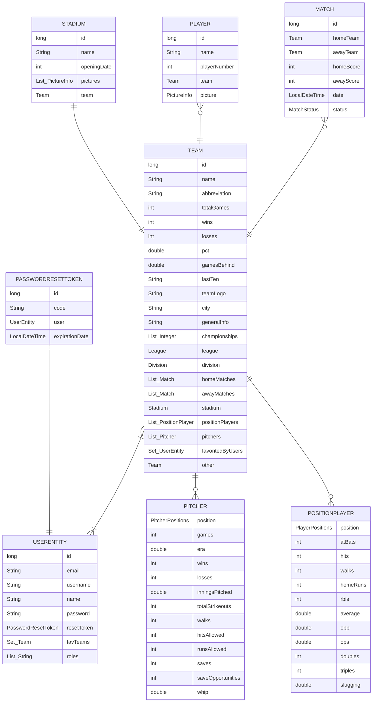

# 📊 Application Analysis: Entities, Relations, and User Permissions

## 🧾 Table of Contents
- [Entities](#-entities)
- [Relations Between Entities](#-relations-between-entities)
- [Types of Users and Browsing Permissions](#-type-of-users-and-browsing-permissions)
- [Entities with Images](#-entities-with-images)
- [Charts](#-charts)
- [Algorithm or Advanced Query](#-algorithm-or-advanced-query)

## 🧠 Entities
- UserEntity
- Team
- Stadium
- Player
- PositionPlayer
- Pitcher
- Match
- Event
- EventManager
- Sector
- Seat
- Ticket
- PasswordResetToken
- SupportMessage
- SupportTicket

> [!IMPORTANT]
> `Player` apart of being a current entity is also an `abstrac class`, from which the entities `PositionPlayer` and `Pitcher` inherit.

> [!IMPORTANT]
> The `PaswordResetToken` entity will be used to give the user an opportunity to create a new password (in case the user have forgotten the previous one, and clicks the "Forgot My Password" option).

> [!IMPORTANT]
> The entities `Ticket` and `SupportTicket` arec completely different. `Ticket` refers to the ticket a user uses to attend a match, while `SupportTicket` refers to an issue a user opens to contact the admins of the application.

---

## 🪢 Relations between Entities
### 🙍 UserEntity
<table>
  <thead>
    <th>Related with...</th>
    <th>Cardinality</th>
  </thead>
  <tbody>
    <tr>
      <td>Team</td>
      <td>N..N</td>
    </tr>
    <tr>
      <td>Ticket</td>
      <td>1..N</td>
    </tr>
    <tr>
      <td>PasswordResetToken</td>
      <td>1..1</td>
    </tr>
  </tbody>
</table>

### ⚾ Team
<table>
  <thead>
    <th>Related with...</th>
    <th>Cardinality</th>
  </thead>
  <tbody>
    <tr>
      <td>User</td>
      <td>N..N</td>
    </tr>
    <tr>
      <td>Player</td>
      <td>1..N</td>
    </tr>
    <tr>
      <td>Stadium</td>
      <td>1..1</td>
    </tr>
    <tr>
      <td>Match</td>
      <td>1..N</td>
    </tr>
  </tbody>
</table>

### 🏃 Player
<table>
  <thead>
    <th>Related with...</th>
    <th>Cardinality</th>
  </thead>
  <tbody>
    <tr>
      <td>Team</td>
      <td>N..1</td>
    </tr>
  </tbody>
</table>

### 🏟️ Stadium
<table>
  <thead>
    <th>Related with...</th>
    <th>Cardinality</th>
  </thead>
  <tbody>
    <tr>
      <td>Team</td>
      <td>1..1</td>
    </tr>
    <tr>
      <td>Match</td>
      <td>1..N</td>
    </tr>
    <tr>
      <td>Sector</td>
      <td>1..N</td>
    </tr>
  </tbody>
</table>

### 🆚 Match
<table>
  <thead>
    <th>Related with...</th>
    <th>Cardinality</th>
  </thead>
  <tbody>
    <tr>
      <td>Team</td>
      <td>N..1</td>
    </tr>
    <tr>
      <td>Stadium</td>
      <td>N..1</td>
    </tr>
  </tbody>
</table>

### Event
<table>
  <thead>
    <th>Related with...</th>
    <th>Cardinality</th>
  </thead>
  <tbody>
    <tr>
      <td>Match</td>
      <td>1..1</td>
    </tr>
    <tr>
      <td>EventManager</td>
      <td>1..N</td>
    </tr>
  </tbody>
</table>

### EventManager
<table>
  <thead>
    <th>Related with...</th>
    <th>Cardinality</th>
  <tbody>
    <tr>
      <td>Event</td>
      <td>N..1</td>
    </tr>
    <tr>
      <td>Sector</td>
      <td>N..1</td>
    </tr>
  </tbody>
  </thead>
</table>

### Sector
<table>
  <thead>
    <th>Related with...</th>
    <th>Cardinality</th>
  </thead>
  <tbody>
    <tr>
      <td>Stadium</td>
      <td>N..1</td>
    </tr>
    <tr>
      <td>Seat</td>
      <td>1..N</td>
    </tr>
  </tbody>
</table>

### Seat
<table>
  <thead>
    <th>Related with...</th>
    <th>Cardinality</th>
  </thead>
  <tbody>
    <tr>
      <td>Sector</td>
      <td>N..1</td>
    </tr>
  </tbody>
</table>

### 🎟️ Ticket
<table>
  <thead>
    <th>Related with...</th>
    <th>Cardinality</th>
  </thead>
  <tbody>
    <tr>
      <td>EventManager</td>
      <td>N..1</td>
    </tr>
    <tr>
      <td>User</td>
      <td>N..1</td>
    </tr>
    <tr>
      <td>Seat</td>
      <td>1..1</td>
    </tr>
  </tbody>
</table>

### 🔐 PasswordResetToken
<table>
  <thead>
    <th>Related with...</th>
    <th>Cardinality</th>
  </thead>
  <tbody>
    <tr>
      <td>User</td>
      <td>1..1</td>
    </tr>
</table>

### SupportMessage
<table>
  <thead>
    <th>Related with...</th>
    <th>Cardinality</th>
  </thead>
  <tbody>
    <tr>
      <td>SupportTicket</td>
      <td>N..1</td>
    </tr>
  </tbody>
</table>

### SupportTicket
<table>
  <thead>
    <th>Related with...</th>
    <th>Cardinality</th>
  </thead>
  <tbody>
    <tr>
      <td>SupportMessage</td>
      <td>1..N</td>
    </tr>
  </tbody>
</table>

Below is the relational diagram illustrating all the entities and their relationships within the application.

---

## 🔒 Type of Users and Browsing Permissions
### 🕵️‍♂️ Anonymous User
- See the general information provided by the application.

### 🧑‍💻 Registered User
- See both general and personalized information provided by the application.
- Access its profile settings.
- Delete Account.
- Add/Remove a team from the favourite list.
- Buy tickets for a game.
- Cancel ticket purchase.
- Receive notifications via email.
- Contact support via email.

### 🔑 Administrator (Admin)
- Update team information.
- Edit player information.
- Edit stadium information.
- Add/Modify tickets.
- Create and Edit a Game.
- Update Game score.
- User´s favourite teams statistics.
- Ticket selling per team statistics.

---

## 📷 Entities with Images
- User
- Team
- Stadium
- Player

---

## 📊 Charts
<table>
  <thead>
    <th>Chart Topic</th>
    <th>Type of Chart</th>
  </thead>
  <tbody>
    <tr>
      <td>Standings (Dynamic)</td>
      <td>Table</td>
    </tr>
    <tr>
      <td>Last 10 Games of a Team</td>
      <td>Line</td>
    </tr>
    <tr>
      <td>Ticket Selling for Each Team</td>
      <td>Bar</td>
    </tr>
    <tr>
      <td>User´s Favourite Teams</td>
      <td>Horizontal Bar</td>
    </tr>
  </tbody>
</table>

> [!NOTE]
> The information described above is subject to change. Both the chart types and topics may be updated as needed.

---

### 📚 Library To Use
Since the front-end will be develop using `Angular`, the library chosen for creating all the charts will be `ng2-charts`, which is a wrapper for the popular chart library `Chart.js`.

---

## 🔍 Algorithm or Advanced Query
This section will be reflected when updating the standings of every division in both leagues, as these will be updated automatically based on the following data:
- A team’s number of wins.
- A team’s number of losses.

From these fields, all of the other team statistics will be calculated automatically, and the standings will be updated accordingly.

---
[👈 Return to README](../README.md)
