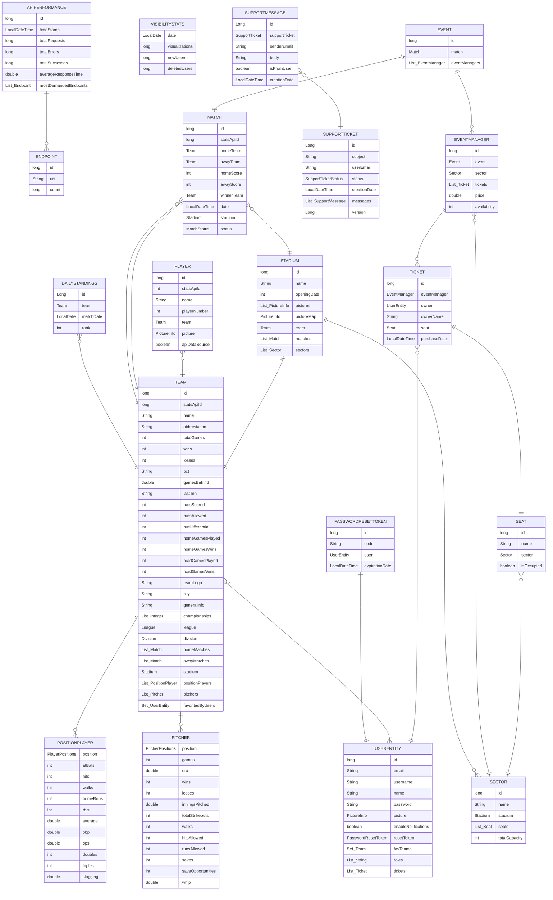

# 📊 Application Analysis: Entities, Relations, and User Permissions

## 🧾 Table of Contents
- [Entities](#-entities)
- [Relations Between Entities](#-relations-between-entities)
- [Types of Users and Browsing Permissions](#-type-of-users-and-browsing-permissions)
- [Entities with Images](#-entities-with-images)
- [Charts](#-charts)
- [Algorithm or Advanced Query](#-algorithm-or-advanced-query)

## 🧠 Entities
- UserEntity
- Team
- Stadium
- Player
- PositionPlayer
- Pitcher
- Match
- Event
- EventManager
- Sector
- Seat
- Ticket
- PasswordResetToken
- SupportMessage
- SupportTicket
- DailyStandings
- APIPerformance
- Endpoint
- VisibilityStats

> [!IMPORTANT]
> `Player` apart of being a current entity is also an `abstrac class`, from which the entities `PositionPlayer` and `Pitcher` inherit.

> [!IMPORTANT]
> The `PaswordResetToken` entity will be used to give the user an opportunity to create a new password (in case the user have forgotten the previous one, and clicks the "Forgot My Password" option).

> [!IMPORTANT]
> The entities `Ticket` and `SupportTicket` arec completely different. `Ticket` refers to the ticket a user uses to attend a match, while `SupportTicket` refers to an issue a user opens to contact the admins of the application.

---

## 🪢 Relations between Entities
### 🙍 UserEntity
<table>
  <thead>
    <th>Related with...</th>
    <th>Cardinality</th>
  </thead>
  <tbody>
    <tr>
      <td>Team</td>
      <td>N..N</td>
    </tr>
    <tr>
      <td>Ticket</td>
      <td>1..N</td>
    </tr>
    <tr>
      <td>PasswordResetToken</td>
      <td>1..1</td>
    </tr>
  </tbody>
</table>

### ⚾ Team
<table>
  <thead>
    <th>Related with...</th>
    <th>Cardinality</th>
  </thead>
  <tbody>
    <tr>
      <td>User</td>
      <td>N..N</td>
    </tr>
    <tr>
      <td>Player</td>
      <td>1..N</td>
    </tr>
    <tr>
      <td>Stadium</td>
      <td>1..1</td>
    </tr>
    <tr>
      <td>Match</td>
      <td>1..N</td>
    </tr>
  </tbody>
</table>

### 🏃 Player
<table>
  <thead>
    <th>Related with...</th>
    <th>Cardinality</th>
  </thead>
  <tbody>
    <tr>
      <td>Team</td>
      <td>N..1</td>
    </tr>
  </tbody>
</table>

### 🏟️ Stadium
<table>
  <thead>
    <th>Related with...</th>
    <th>Cardinality</th>
  </thead>
  <tbody>
    <tr>
      <td>Team</td>
      <td>1..1</td>
    </tr>
    <tr>
      <td>Match</td>
      <td>1..N</td>
    </tr>
    <tr>
      <td>Sector</td>
      <td>1..N</td>
    </tr>
  </tbody>
</table>

### 🆚 Match
<table>
  <thead>
    <th>Related with...</th>
    <th>Cardinality</th>
  </thead>
  <tbody>
    <tr>
      <td>Team</td>
      <td>N..1</td>
    </tr>
    <tr>
      <td>Stadium</td>
      <td>N..1</td>
    </tr>
  </tbody>
</table>

### ✨ Event
<table>
  <thead>
    <th>Related with...</th>
    <th>Cardinality</th>
  </thead>
  <tbody>
    <tr>
      <td>Match</td>
      <td>1..1</td>
    </tr>
    <tr>
      <td>EventManager</td>
      <td>1..N</td>
    </tr>
  </tbody>
</table>

### 📋 EventManager
<table>
  <thead>
    <th>Related with...</th>
    <th>Cardinality</th>
  <tbody>
    <tr>
      <td>Event</td>
      <td>N..1</td>
    </tr>
    <tr>
      <td>Sector</td>
      <td>N..1</td>
    </tr>
  </tbody>
  </thead>
</table>

### 📍 Sector
<table>
  <thead>
    <th>Related with...</th>
    <th>Cardinality</th>
  </thead>
  <tbody>
    <tr>
      <td>Stadium</td>
      <td>N..1</td>
    </tr>
    <tr>
      <td>Seat</td>
      <td>1..N</td>
    </tr>
  </tbody>
</table>

### 🪑 Seat
<table>
  <thead>
    <th>Related with...</th>
    <th>Cardinality</th>
  </thead>
  <tbody>
    <tr>
      <td>Sector</td>
      <td>N..1</td>
    </tr>
  </tbody>
</table>

### 🎟️ Ticket
<table>
  <thead>
    <th>Related with...</th>
    <th>Cardinality</th>
  </thead>
  <tbody>
    <tr>
      <td>EventManager</td>
      <td>N..1</td>
    </tr>
    <tr>
      <td>User</td>
      <td>N..1</td>
    </tr>
    <tr>
      <td>Seat</td>
      <td>1..1</td>
    </tr>
  </tbody>
</table>

### 🔐 PasswordResetToken
<table>
  <thead>
    <th>Related with...</th>
    <th>Cardinality</th>
  </thead>
  <tbody>
    <tr>
      <td>User</td>
      <td>1..1</td>
    </tr>
</table>

### 💬 SupportMessage
<table>
  <thead>
    <th>Related with...</th>
    <th>Cardinality</th>
  </thead>
  <tbody>
    <tr>
      <td>SupportTicket</td>
      <td>N..1</td>
    </tr>
  </tbody>
</table>

### 🔧 SupportTicket
<table>
  <thead>
    <th>Related with...</th>
    <th>Cardinality</th>
  </thead>
  <tbody>
    <tr>
      <td>SupportMessage</td>
      <td>1..N</td>
    </tr>
  </tbody>
</table>

### 🏆 DailyStandings
<table>
  <thead>
    <th>Related with...</th>
    <th>Cardinality</th>
  </thead>
  <tbody>
    <tr>
      <td>Team</td>
      <td>N..1</td>
    </tr>
  </tbody>
</table>

### 📉 APIPerformance
<table>
  <thead>
    <th>Related with...</th>
    <th>Cardinality</th>
  </thead>
  <tbody>
    <tr>
      <td>Endpoint</td>
      <td>1..N</td>
    </tr>
  </tbody>
</table>

### 🚪 Endpoint
<table>
  <thead>
    <th>Related with...</th>
    <th>Cardinality</th>
  </thead>
  <tbody>
    <tr>
      <td>-</td>
      <td>-</td>
    </tr>
  </tbody>
</table>

### 👁️ VisibilityStats
<table>
  <thead>
    <th>Related with...</th>
    <th>Cardinality</th>
  </thead>
  <tbody>
    <tr>
      <td>-</td>
      <td>-</td>
    </tr>
  </tbody>
</table>

Below is the relational diagram illustrating all the entities and their relationships within the application.

```mermaid
erDiagram
  APIPERFORMANCE {
    long id
    LocalDateTime timeStamp
    long totalRequests
    long totalErrors
    long totalSuccesses
    double averageResponseTime
    List_Endpoint mostDemandedEndpoints
  }

  ENDPOINT {
    long id
    String uri
    long count
  }

  VISIBILITYSTATS {
    LocalDate date
    long visualizations
    long newUsers
    long deletedUsers
  }

  DAILYSTANDINGS {
    Long id
    Team team
    LocalDate matchDate
    int rank
  }

  MATCH {
    long id
    long statsApiId
    Team homeTeam
    Team awayTeam
    int homeScore
    int awayScore
    Team winnerTeam
    LocalDateTime date
    Stadium stadium
    MatchStatus status
  }

  PASSWORDRESETTOKEN {
    long id
    String code
    UserEntity user
    LocalDateTime expirationDate
  }

  PITCHER {
    PitcherPositions position
    int games
    double era
    int wins
    int losses
    double inningsPitched
    int totalStrikeouts
    int walks
    int hitsAllowed
    int runsAllowed
    int saves
    int saveOpportunities
    double whip
  }

  PLAYER {
    long id
    int statsApiId
    String name
    int playerNumber
    Team team
    PictureInfo picture
    boolean apiDataSource
  }

  POSITIONPLAYER {
    PlayerPositions position
    int atBats
    int hits
    int walks
    int homeRuns
    int rbis
    double average
    double obp
    double ops
    int doubles
    int triples
    double slugging
  }

  STADIUM {
    long id
    String name
    int openingDate
    List_PictureInfo pictures
    PictureInfo pictureMap
    Team team
    List_Match matches
    List_Sector sectors
  }

  SUPPORTMESSAGE {
    Long id
    SupportTicket supportTicket
    String senderEmail
    String body
    boolean isFromUser
    LocalDateTime creationDate
  }

  SUPPORTTICKET {
    Long id
    String subject
    String userEmail
    SupportTicketStatus status
    LocalDateTime creationDate
    List_SupportMessage messages
    Long version
  }

  TEAM {
    long id
    long statsApiId
    String name
    String abbreviation
    int totalGames
    int wins
    int losses
    String pct
    double gamesBehind
    String lastTen
    int runsScored
    int runsAllowed
    int runDifferential
    int homeGamesPlayed
    int homeGamesWins
    int roadGamesPlayed
    int roadGamesWins
    String teamLogo
    String city
    String generalInfo
    List_Integer championships
    League league
    Division division
    List_Match homeMatches
    List_Match awayMatches
    Stadium stadium
    List_PositionPlayer positionPlayers
    List_Pitcher pitchers
    Set_UserEntity favoritedByUsers
  }

  EVENT {
    long id
    Match match
    List_EventManager eventManagers
  }

  EVENTMANAGER {
    long id
    Event event
    Sector sector
    List_Ticket tickets
    double price
    int availability
  }

  SEAT {
    long id
    String name
    Sector sector
    boolean isOccupied
  }

  SECTOR {
    long id
    String name
    Stadium stadium
    List_Seat seats
    int totalCapacity
  }

  TICKET {
    long id
    EventManager eventManager
    UserEntity owner
    String ownerName
    Seat seat
    LocalDateTime purchaseDate
  }

  USERENTITY {
    long id
    String email
    String username
    String name
    String password
    PictureInfo picture
    boolean enableNotifications
    PasswordResetToken resetToken
    Set_Team favTeams
    List_String roles
    List_Ticket tickets
  }

  APIPERFORMANCE ||--o{ ENDPOINT : ""
  DAILYSTANDINGS }o--|| TEAM : ""
  MATCH }o--|| TEAM : ""
  MATCH ||--|| TEAM : ""
  MATCH }o--|| STADIUM : ""
  PASSWORDRESETTOKEN ||--|| USERENTITY : ""
  PLAYER }o--|| TEAM : ""
  STADIUM ||--|| TEAM : ""
  STADIUM ||--o{ SECTOR : ""
  SUPPORTMESSAGE }o--|| SUPPORTTICKET : ""
  TEAM ||--o{ POSITIONPLAYER : ""
  TEAM ||--o{ PITCHER : ""
  TEAM }|--|{ USERENTITY : ""
  EVENT ||--|| MATCH : ""
  EVENT ||--o{ EVENTMANAGER : ""
  EVENTMANAGER }o--|| SECTOR : ""
  EVENTMANAGER ||--o{ TICKET : ""
  SEAT }o--|| SECTOR : ""
  TICKET }o--|| USERENTITY : ""
  TICKET ||--|| SEAT : ""
```

---

## 🔒 Type of Users and Browsing Permissions
### 🕵️‍♂️ Anonymous User
- Access the following pages:
  - Standings.
  - Player Rankings.
  - Teams 
- Contact Support.
- Refresh season standings.

### 🧑‍💻 Registered User
- Same actions as an anoymous user.
- Access its profile settings.
- Delete Account.
- Add/Remove a team from the favorite list.
- Buy tickets for a game.
- Cancel ticket purchase.
- Receive notifications via email.
- Contact support via email.

### 🔑 Administrator (Admin)
- Update team information.
- Edit player information.
- Edit stadium information.
- Add/Modify tickets.
- Application Analytics Section:
  - Visibility Analytics.
  - API Performance Analytics
  - Cache Management
  - User's favorite teams Analytics.
- Refresh player rankings.
- Refresh matches of the current season. 

---

## 📷 Entities with Images
- User
- Team
- Stadium
- Player

---

## 📊 Charts
<table>
  <thead>
    <th>Type of Chart</th>
    <th>Chart Topics</th>
  </thead>
  <tbody>
    <tr>
      <td>Line</td>
      <td>Visibility Analytics, Requests and Latency per day (API Performance), Team Historic Ranking (Team Statistics)</td>
    </tr>
    <tr>
      <td>Bar</td>
      <td>Player Rankings, Runs Scored/Allowed of a team (Team Statistics), Most Demanded Endpoints (API Performance), Favorite Teams per User</td>
    </tr>
    <tr>
      <td>Pie</td>
      <td>Successful vs Failed Requests (API Performance), Win Distribution and Wins per Rival (Team Statistics)</td>
    </tr>
  </tbody>
</table>

### 📚 Library To Use
Since the front-end will be develop using `Angular`, the library chosen for creating all the charts will be `ng2-charts`, which is a wrapper for the popular chart library `Chart.js`.

---

## 🔍 Algorithm or Advanced Query

### Internal Messaging System
The application features an internal messaging system between users and admins to report any issues encountered. The workflow is simple: a user creates a support ticket which is sended to the admins. Admins access these tickets through a personal inbox, where they can reply to or close them.

To complete this operation, the system integrates `Java Mail Sender` for notifications, a `polling mechanism` to provide admins with real-time updates on the amount of open tickets, and a `concurrency control system`. This last component prevents multiple admins from simultaneously editing or closing the same ticket. This safety measure is implemented via `Optimistic Locking`, which utilizes database versioning to automatically manage concurrent access and lock tickets currently under review by another admin.

### Event Management
The application provides users with the option to purchase tickets for different matches. To make a more realistic system, each stadium has their own sectos and seats, with each sector having their own price, this means that the amount of sectors, seats, prices can vary depending on the stadium and on the event aswell. This was done thanks to the `EventManager` entity wich is the entity in charge of manage this dynamic information for each event.

Concurrency problems, like seats being taken while a payment is in progress, are handled through strict database access control. The system manages simultaneous queries to prevent data inconsistencies and ensures that users are successfully notified if their selection is no longer available.

### Player Rankings
The application allows users to view player rankings for each statistic of the current season (for both pitchers and position players). This feature includes a vast variety of filters that allows users to refine their search.

Since the statistic provided by the user changes dynamically, and the tables used to extract the data also changes because they depended on the selected player type, a traditional database query could not be executed due to the query dynamic behavior. Therefore, the query was constructed manually, inserting the corresponding data for each case, the desired statistic, and the active filters. Once the query was complete, it was executed using the `EntityManager`.

The EntityManager is the main JPA interface that acts as an intermediary between the Spring (Java) application and the database.

---
[👈 Return to README](../README.md)
