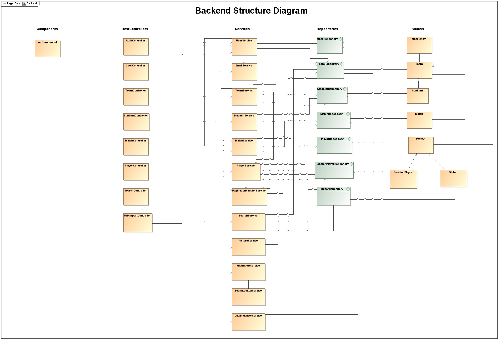
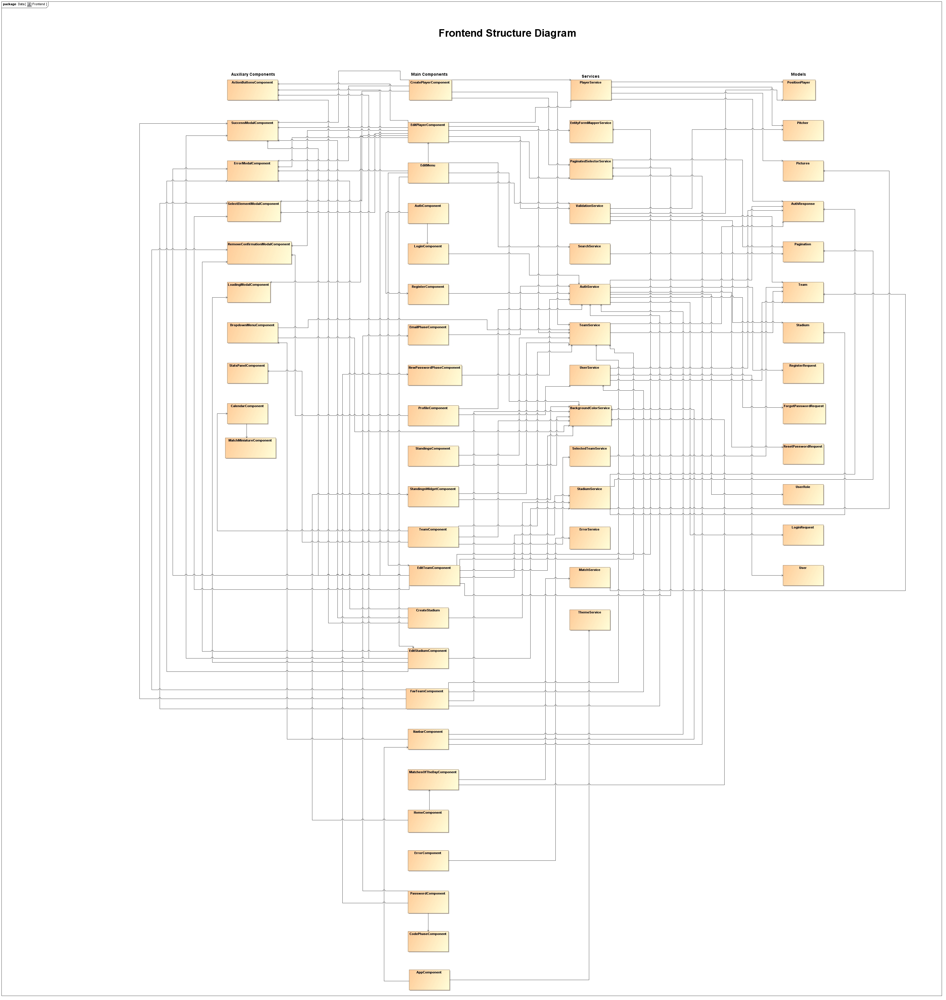
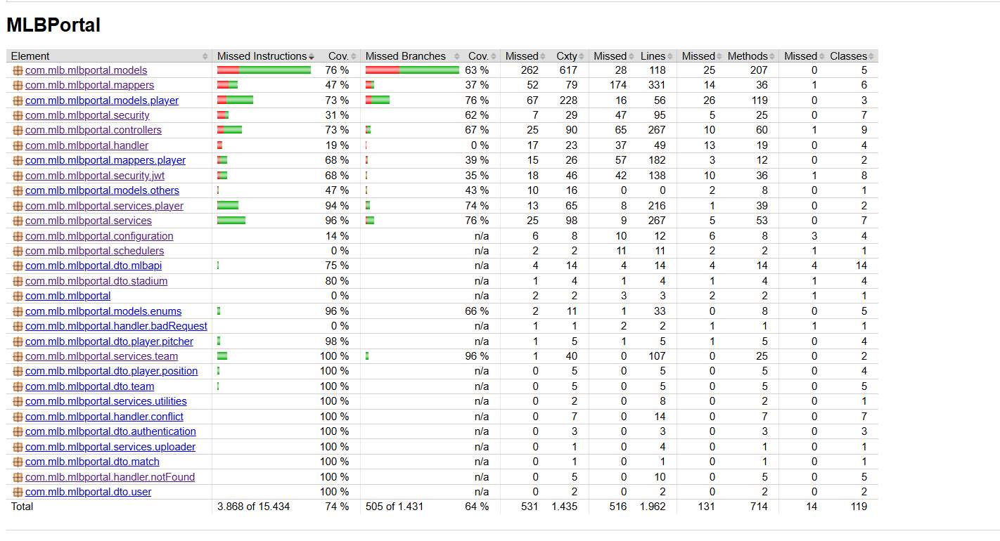
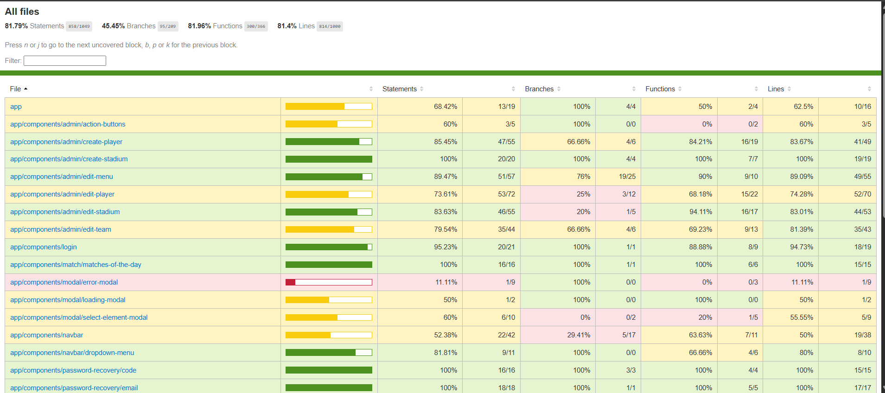

# 🛠️ Development Guide

## 🧾 Table of Contents
- [Introduction](#-introduction)
- [Technologies](#-technologies)
- [Tools](#-tools)
- [Execution Environments (Profiles)](#-execution-environments-profiles)
- [Architecture](#️-architecture)
- [Deployment with Docker](#-deployment-with-docker)
- [Quality Control](#-quality-control)
- [Development Process](#-development-process)

## 📖 Introduction
The MLB Portal application is built with a `SPA (Single Page Application)` architecture on the client side (frontend). A `SPA` is a web application which only loads a single HTML file and updates the content dynamically using JavaScript instead of loading entire pages from the server. This SPA was developed using `Angular 20`.

On the server side of the application (backend), it was developed with `Spring Boot`, providing a `REST API` as the communciation method between the server and the client.

For the data management, the application uses a `PostgreSQL` database.

For deployment and the containerization technology, `Docker` was used.

As it can be seen, the architecture of the application is `monolithic` divided into two main layers:
- **Client (frontend)** --> Angular.
- **Server (backend)** --> Spring Boot exposing a REST API, and a PostgreSLQ database.

### 📌 Summary
<table>
  <thead>
    <th>Component</th>
    <th>Description</th>
  </thead>
  <tbody>
    <tr>
      <td>Application Type</td>
      <td>Web SPA with REST API</td>
    </tr>
    <tr>
      <td>Application Architecture</td>
      <td>Monolithic</td>
    </tr>
    <tr>
      <td>Frontend</td>
      <td>Angular, TailwindCSS</td>
    </tr>
    <tr>
      <td>Backend</td>
      <td>Spring Boot, Resilience4J</td>
    </tr>
    <tr>
      <td>Database</td>
      <td>PostgreSQL, MYSQL</td>
    </tr>
    <tr>
      <td>Languages</td>
      <td>Java, TypeScript and JavaScript</td>
    </tr>
  <tr>
    <td>IDE</td>
    <td>Visual Studio Code, IntelliJ</td>
  </tr>
  <tr>
    <td>Auxiliary Tools</td>
    <td>DBeaver, REST Client (Visual Studio Extension), JaCoCo, Git and GitHub</td>
  </tr>
  <tr>
    <td>External Services</td>
    <td>Cloudinary, statsAPI</td>
  </tr>
  <tr>
    <td>Tests</td>
    <td>Unit, Integration and System (e2e) Tests</td>
  </tr>
  <tr>
    <td>Testing Libraries</td>
    <td>JUnit, AssertJ, Mockito, REST Assured, Jasmine, Karma and Cypress</td>
  </tr>
  <tr>
    <td>Deployment</td>
    <td>Docker</td>
  </tr>
  <tr>
    <td>Development Process</td>
    <td>Iterative and incremental, version control with Git and CI/CD with GitHub Actions</td>
  </tr>
  </tbody>
</table>

---
## 💻 Technologies
The application uses the following technologies for its execution:

### Frontend
- **Node.js:** Execution environment for JavaScript on the server side, allowing JavaScript code to run outside the browser. For more information, consult the [Node.js official website](https://nodejs.org/en).
- **npm:** The official package manager for Node.js. For more information, consult the [npm official website](https://www.npmjs.com).
- **Angular:** Framework for developing web applications on the frontend, enabling the creation of Single Page Applications (SPAs). For more information, consult the [Angular official website](https://angular.dev).

### Backend
- **Maven:** Build and dependency management tool for Java projects. For more information, consult the [Maven official website](https://maven.apache.org/).
- **Spring Boot:** Backend framework for developing Java web applications and REST APIs. For more information, consult the [Spring official website](https://spring.io/projects/spring-boot). Main modules:
  - **Spring MVC:** To develop web applications and controllers.
  - **Spring Data:** To interact with the database.
  - **Spring Security:**  For authentication and authorization.
- **PostgreSQL:** Main DB of the application. It is used in the `production environment (prod profile)`. For more information, consult the [PostgreSQL official website](https://www.postgresql.org/)
- **MySQL:** Auxiliary DB used only on the `docker environment (mysql 8 image)`. For more information, consult the [MySQL official website](https://www.mysql.com/).

### Deployment
- **Docker:** Containerization technology used to deploy the application. For more information, consult the [Docker official website](https://www.docker.com/).

---
## 🔧 Tools
The following IDEs and auxiliary tools were used during the development of the application:

### IDEs
- **Visual Studio Code:** Lightweight open-source code editor with support for extensions. It was used for developing of both frontend and backend side of the application.
- **IntelliJ:** Powerful IDE for Java and other programming languages. It was used as a backup IDE to develop the backend side of the application.

### Database
- **DBeaver:** A database management tool for browsing, querying, and managing SQL databases.

### Auxiliary Tools
- **REST Client:** Visual Studio Code extension that allows you to send HTTP requests and view responses directly within the editor
- **Git:** A distributed version control system used to track changes in the source code during the software development process.
- **GitHub:** A cloud-based platform that hosts Git repositories and adds collaboration features for developers. Inside of it, we can find:
  - **GitHub Actions:** Used for the CI process.
  - **GitHub Projects:** Helps organize the tasks in a Kanban board view.
- **JaCoCo :** Is a Java code coverage library used to measure how much of your code is executed during the automated tests.
- **Docker Desktop**: Is an application that provides a user-friendly interface to build, run, and manage Docker containers on Windows or Mac. It also includes Docker Engine, Docker Compose, etc, which simplifies the container-based development.
- **Cloudinary:** Cloud-based service for storing, managing, and delivering media assets.
- **Resilience4J:** Is a lightweight fault tolerance library for Java applications. It helps the application to respond gracefully when an external service they depend on fails.

---
## 🌍 Execution Environments (Profiles)
To facilitate the development and testing process, four different profiles were configured for certain tasks and scenarios within the development. This profiles allows the application to have different configurations depending on the execution environment, such as testing, production, development, etc, favoring the maintainability and portability of the application. This also follows the modern practices of `Software as a Service Applications (SaaS)`, such as the [Twelve-Factor App Methodology](https://12factor.net/es/). 

Here are the configured profiles:

- **Test:** Exclusive profile for testing; this disables all application security (SSL) to prevent problems in integration and e2e testing in the CI pipeline. This is configured in the [application-test.properties](../backend/src/test/resources/application-test.properties).
- **Prod:** Main and stable profile of the application using a `PostgreSQL` DB for real data persistency. This is configured in the [application-prod.properties](../backend/src/main/resources/application-prod.properties).
- **Dev:** Profile used during the development of any feature or bugfix, using a in-memory DB (H2) for more simplicity. This is configured in the [application-dev.properties](../backend/src/main/resources/application-dev.properties).
- **Docker:** Profile only used for the running of the application in an containerized environment. It uses a `MYSQL` DB with the `mysql 8` docker image. This is configured in the [application-docker.properties](../backend/src/main/resources/application-docker.properties).

All common application settings are stored in the file [application.properties](../backend/src/main/resources/application.properties).

```mermaid
flowchart LR
    A(Test) -- "Testing Environment" --> H[(H2 in memory DB)]
    B(Prod) -- "Production Environment" --> P[(PostgreSQL)]
    C(Dev) -- "Development Environment" --> H
    D(Docker) -- "Containerized Environment" --> M[(MYSQL)]
````

---
## 🏗️ Architecture
### 🔄 Communication Flow
1) The user interacts with the frontend (Angular).
2) The frontend sends requests to the backend (Spring) through the REST API.
3) The backend interacts with the PostgreSQL database through JDBC to persist the data.

```mermaid
flowchart LR
    A[User] -- "HTTP:4200" --> B[Angular Frontend]
    B -- "API Request" --> C[Backend Spring Boot]
    C -- "API Response" --> B
    C -- "JDBC/SQL:5432" --> D[(PostgreSQL)]
    D -- "SQL Response:5432" --> C
````
> [!NOTE]
> This flow represents the `production environment (profile)`, the flow of the other profiles is exactly the same but the DB varies: In dev --> H2 in memory DB; In docker --> MYSQL (port 3306)

### 🚀 Deployment
The deployment of the application is divided into three different proceses:
- **Frontend:** Runs in a development server on port `4200`.
- **Backend:** Runs on port `8443`.
- **Database:** Runs on port `3306`.

### 🔗 Communication Protocols
- **Frontend <--> Backend:** REST API over HTTPS.
- **Backend <--> Database:** SQL queries over JDBC (TCP/IP).

### 📡 REST API
The backend exposes a `REST API` as communication method with the frontend.
- This API have been decoumented using `OPEN API (Swagger)`.
- OpenAPI documentation can be accessible without executing the application in a static HTML file format.

👉 [View REST API Documentation](./api)

### 🧠 Backend Structure
The following diagram illustrates the backend structire, showing each layer of the `hexagonal architecture`, and how the interact between each other.



### 🌐 Frontend Structure
The following diagram illustrates the frontend structire, showing each layer of the `MVC architecture`, and how the interact between each other.



### 🧱 Project Architecture
The following diagram illustrates the project architecture, showing how each component is connected and interacts with the others. It provides a clearer understanding of the overall structure of the application.


> [!NOTE]
> In case you want to interact with the diagram, you can access it directly through the [GitDiagram website](https://gitdiagram.com/codeurjc-students/2025-MyMLB).

---
## 🧪 Quality Control

### Backend Tests
- **Unit Tests:** Their purpose is to `isolate the business logic (located in the Services)` and validate it. This is achieved by using `Mocks` to "simulate" the behavior of dependencies (such as Repositories). In other words, these tests focus exlusively on the business in the `Services`, while the corresponding dependencies (typically `Repositories`) are replaced with `Mocks`.
- **Integration Tests:** Their purpose is to validate the proper interaction between the database and the rest of the backend application. Since the goal is to test this integration, the dependencies are not replaced with Mocks.
- **System/e2e Tests:** Their purpose is to test the communication to the frontend, in other words, the `REST API`. These tests validate the system end to end, ensuring that requests to the API return the expected responses. This type of test were implemented by using the `REST Assured` library.

#### Test Metrics
The following picture illustrates the coverage report of the executed tests generated by `JaCoCo `:



To generate this report, you only need to execute the following command:

```bash
mvn test
````

By default, JaCoCo generates its reports in `backend/target/site/jacoco`. In this project, however, the plugin configuration in the `pom.xml` was adjusted so that the output is generated outside the `target` folder (which is included in `.gitignore`). This way, the coverage report remains accessible at any time directly from the repository.

```xml
<pluginManagement>
  <plugins>
    <plugin>
      <groupId>org.jacoco</groupId>
      <artifactId>jacoco-maven-plugin</artifactId>
      <version>0.8.11</version>
     </plugin>
  </plugins>
</pluginManagement>
<plugins>
  <plugin>
    <artifactId>maven-surefire-plugin</artifactId>
    <version>3.2.5</version>
  </plugin>
  <plugin>
    <groupId>org.jacoco</groupId>
    <artifactId>jacoco-maven-plugin</artifactId>
    <executions>
      <execution>
        <goals>
          <goal>prepare-agent</goal>
        </goals>
      </execution>
      <execution>
        <id>report</id>
        <phase>test</phase>
        <goals>
          <goal>report</goal>
        </goals>
        <configuration>
          <outputDirectory>${project.basedir}/coverage</outputDirectory>
        </configuration>
      </execution>
    </executions>
</plugin>
````

As shown in the snippet above, the coverage report is generated in `backend/coverage`. Opening the `index.html` file from that folder will display the report in the browser.

### Frontend Tests
- **Unit Tests:** Their purpose is to `isolate the business logic` and validate it. This is achieved by using `Mocks` to "simulate" the behavior of dependencies. In this context, these tests are applied to `Services` and `Components` in order to verify the proper functionality of each service and component independently.
- **Integration Tests:** Their purpose is to validate the proper interaction between the `services` and the `components`. Since the goal is to test this integration, the dependencies are not replaced with Mocks.
- **System/e2e Tests:** Their purpose is to verify that the `view` is rendered correctly. These tests validate the end-to-end behavior of the application in the frontend (user´s perspective). This type of test were implemented by using the `Cypress` framework.

#### Test Run
To run the unit tests:
```bash
npm run test:unit
```

To run the integration tests:
```bash
npm run test:integration
```

To run the system (e2e) tests in headless mode (without UI):

> [!IMPORTANT]
> To run these test, the frontend needs to be running, so before everything run `ng serve`.

```bash
npx cypress run
```

And with UI:
```bash
npx cypress open
```

#### Test Metrics
The following picture illustrates the coverage report of the executed tests generated by `Karma + Istanbul`:



To generate this report, you only need to execute the following command:

```bash
ng test --watch=false --code-coverage
# or
npm run test:coverage
````

This will generate it in `frontend/coverage/frontend`. Opening the `index.html` file will show the report in the browser.

---

## 🐋 Deployment with Docker

### Image Creation
The project generates Docker images with two different tags: one for development (`dev`) and other for production, which corresponds to the current version of the project (currently `0.1`). To build the image using the `Dockerfile`, navigate to the project’s root directory and run the following command:

```bash
docker build -f ./docker/Dockerfile -t docker.io/fonssi29/mlb-portal:tag .
```

### Images Publication
The image were published at `Docker Hub` in this [Docker Repository](https://hub.docker.com/repository/docker/fonssi29/mlb-portal/general), using the following command:

```bash
docker push fonssi29/mlb-portal:tag
```

Once published, the `image` can be used locally by pulling it from the repository:

```bash
docker pull fonssi29/mlb-portal:tag
```

### Compose Publication as an OCI Artifact
The [docker-compose.yml](https://github.com/codeurjc-students/2025-MyMLB/blob/main/docker/docker-compose.yml) file was published as a `OCI artifact` in this [Docker Repository](https://hub.docker.com/repository/docker/fonssi29/mlb-portal-compose/general), using the following command:

```bash
docker compose -f ./docker/docker-compose.yml publish docker.io/fonssi29/mlb-portal-compose:tag --with-env -y
```

Once published, the `compose` can be used locally by pulling it from the repository:

```bash
docker compose pull
```

### Deploying the Application wiht the Compose File
To deploy the application, run the `docker-compose` file using the following command:

```bash
docker compose -f ./docker/docker-compose.yml up
```

> [!NOTE]
> Alternatively, you can run the services in the background by adding the `-d` flag.

---
## 🔄 Development Process
The development process of the application follows an `iterative and incremental` process that follows the principles of the `Agile Manifesto` and incorporates some best practices from `Extreme Programming (XP) and Kanban` such as short development iterations, automated testing and continous integration (CI).

### 📋 Task Management
For managing the tasks during the development process, it was used `GitHub Issues and GitHub Projects`.
- **GitHub Issues** --> Represent the tasks of each development phase, grouped by `milestones` which represent each phase.
- **GitHub Project:** --> Provide a `Kanban view board` to organize all the `Issues`.

#### GitHub Project Board


### 🗂️ Git
Git was used as the version control tool. This project follows `GitHub Flow` as the branching strategy, these branches are the following:

- **main/master:** Stable branch and always ready to be deployed.
- **feature:** These branches are where the features are implemented. Each branch represent a single feature with its corresponding tests.
- **fix:** Branches where bug-fixing occurs. Each branch represent a single bug.
- **config:** Branches to add configuration to the project.
- **documentation:** Branches to add project documentation.

At the end, every branch is added to `main/master` with `Pull Requests`.

### 🤖 Continous Integration (CI)
For CI, this project uses `GitHub Actions` in which two workflows were implemented to ensure the quality control:

#### Basic Quality Control
This workflow triggers on every commit made on the `feature/*`, `fix/*` and `config/*` branches.

#### Jobs
- **build-backend:** Set up and compile the backend.
- **backend-unit-tests:** Execute the unit tests of the backend with `mvn test -Dsurefire.excludes="**/integration/**,**/e2e/**"`
- **build-frontend:** Set up and compile the frontend.
- **frontend-unit-tests:** Execute the unit tests of the frontend with `npm run test:unit`.

#### Complete Quality Control
This workflow triggers on every push to main.

#### Jobs
- **build-backend:** Set up and compile the backend.
- **backend-unit-tests:** Execute the unit tests of the backend with `mvn test -Dsurefire.excludes="**/integration/**,**/e2e/**"`.
- **backend-integration-tests:** Execute the integration tests of the backend with `mvn test -Dsurefire.excludes="**/integration/**,**/e2e/**"`.
- **backend-e2e-tests:** Execute the e2e/system tests of the backend with `mvn test -Dsurefire.excludes="**/integration/**,**/unit/**"`.
- **build-frontend:** Set up and compile the frontend.
- **frontend-unit-tests:** Execute the unit tests of the frontend with `npm run test:unit`.
- **frontend-unit-tests:** Execute the unit tests of the frontend with `npm run test:unit`.
- **frontend-integration-tests** Execute the integration tests of the frontend with `npm run test:integration`.
- **frontend-e2e-tests:** Serve Angular in the background with `npx ng serve --port 4200 --host 0.0.0.0 &`, then wait for it to be ready with `npx wait-on http://localhost:4200`, and finally executes the e2e tests with cypress `npx cypress run --config baseUrl=http://localhost:4200`.

#### Sonar Build
This workflow enables the integration of `SonarCloud` with the repository, allowing it to run the corresponding `static code analysis`. Through this process, SonarCloud performs a set of quality checks such as code smells, bugs, vulnerabilities, and coverage metrics, and then links the results directly to the repository for easier tracking and continuous improvement.

#### Continous Integration Diagram


### 📦 Continous Delivery (CD)
For CD, this project uses three workflows that triggers on different scenarios: pull request to main, workflow dispatch from any branch, and when a release occur.

#### CD Main
This workflow triggers on ever pull request open to the main branch.

#### Jobs
- **build-backend:** Set up and compile the backend.
- **build-frontend:** Set up and compile the frontend.
- **docker-build-push:** Build the docker image under the `dev` tag with `docker build -f ./docker/Dockerfile -t fonssi29/mlb-portal:tag .`,  and publish it on `Docker Hub` with `docker push fonssi29/mlb-portal:tag`.
- **publish-compose:** Publish the compose as an OCI artifact using the [docker-compose.yml](https://github.com/codeurjc-students/2025-MyMLB/blob/main/docker/docker-compose.yml) file, under the `dev` tag with `docker compose -f ./docker/docker-compose.yml publish docker.io/fonssi29/mlb-portal-compose:dev --with-env -y`.

#### CD Dispatch
This workflow triggers manually from every branch. The jobs are exactly the same one as the previous workflow, the difference is that the tag will be `<branch-name>-<date-hour>-<commit>`.

#### CD Release
This workflow is triggered whenever a `release` occurs. The jobs are the same as in the previous workflows; however, it publishes both Docker images and Compose artifacts using the release version and latest as tags.

### 🌙 Nightly
To complement the CI pipeline, two scheduled workflows were established to run every night (one for the back and one for the front). These worflows perfomance a full suite of automated tests, ensuring:
- **Integrity:** Continous verifications that daily changes doesn't break the stable version.
- **Reliability:** Ensure an early detection of regressions or bugs.

These workflows ensure that the application has a stable version in production and, if any regression occurs, it is quickly reported and managed in development.

---
[👈 Return to README](../README.md)
