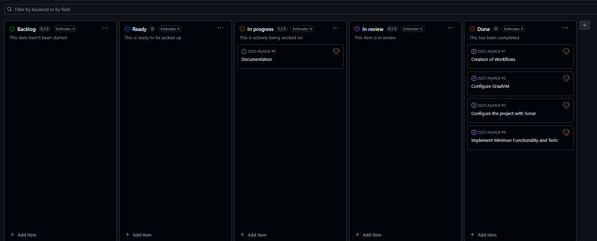

# 🛠️ Development Guide

## 🧾 Table of Contents
- [Introduction](#-introduction)
- [Technologies](#-technologies)
- [Tools](#-tools)
- [Architecture](#️-architecture)
- [Quality Control](#-quality-control)
- [Development Process](#-development-process)

## 📖 Introduction
The MLB Portal application is built with a `SPA (Single Page Application)` architecture on the client side (frontend). A `SPA` is a web application which only loads a single HTML file and updates the content dynamically using JavaScript instead of loading entire pages from the server. This SPA was developed using `Angular 20`.

On the server side of the application (backend), it was developed with `Spring Boot`, providing a `REST API` as the communciation method between the server and the client.

For the data management, the application uses a `MySQL` database.

As it can be seen, the architecture of the application is `monolithic` divided into two main layers:
- **Client (frontend)** --> Angular.
- **Server (backend)** --> Srping Boot exposing a REST API, and a MySQL database.

### 📌 Summary
<table>
  <thead>
    <th>Component</th>
    <th>Description</th>
  </thead>
  <tbody>
    <tr>
      <td>Application Type</td>
      <td>Web SPA with REST API</td>
    </tr>
    <tr>
      <td>Application Architecture</td>
      <td>Monolithic</td>
    </tr>
    <tr>
      <td>Frontend</td>
      <td>Angular, TailwindCSS</td>
    </tr>
    <tr>
      <td>Backend</td>
      <td>Spring Boot, Resilience4J</td>
    </tr>
    <tr>
      <td>Database</td>
      <td>MySQL</td>
    </tr>
    <tr>
      <td>Languages</td>
      <td>Java, TypeScript and JavaScript</td>
    </tr>
  <tr>
    <td>IDE</td>
    <td>Visual Studio Code, IntelliJ</td>
  </tr>
  <tr>
    <td>Auxiliary Tools</td>
    <td>REST Client (Visual Studio Extension), JaCoCo, Git and GitHub</td>
  </tr>
  <tr>
    <td>External Services</td>
    <td>Cloudinary, statsAPI</td>
  </tr>
  <tr>
    <td>Tests</td>
    <td>Unit, Integration and System (e2e) Tests</td>
  </tr>
  <tr>
    <td>Testing Libraries</td>
    <td>JUnit, AssertJ, Mockito, REST Assured, Jasmine, Karma and Cypress</td>
  </tr>
  <tr>
    <td>Deployment</td>
    <td>Docker</td>
  </tr>
  <tr>
    <td>Development Process</td>
    <td>Iterative and incremental, version control with Git and CI/CD with GitHub Actions</td>
  </tr>
  </tbody>
</table>

---
## 💻 Technologies
The application uses the following technologies for its execution:

### Frontend
- **Node.js:** Execution environment for JavaScript on the server side, allowing JavaScript code to run outside the browser. For more information, consult the [Node.js official website](https://nodejs.org/en).
- **npm:** The official package manager for Node.js. For more information, consult the [npm official website](https://www.npmjs.com).
- **Angular:** Framework for developing web applications on the frontend, enabling the creation of Single Page Applications (SPAs). For more information, consult the [Angular official website](https://angular.dev).

### Backend
- **Maven:** Build and dependency management tool for Java projects. For more information, consult the [Maven official website](https://maven.apache.org/).
- **Spring Boot:** Backend framework for developing Java web applications and REST APIs. For more information, consult the [Spring official website](https://spring.io/projects/spring-boot). Main modules:
  - **Spring MVC:** To develop web applications and controllers.
  - **Spring Data:** To interact with the database.
  - **Spring Security:**  For authentication and authorization.
- **MySQL:** Database used to store and manage the application data. For more information, consult the [MySQL official website](https://www.mysql.com/).

---
## 🔧 Tools
The following IDEs and auxiliary tools were used during the development of the application:

### IDEs
- **Visual Studio Code:** Lightweight open-source code editor with support for extensions. It was used for developing of both frontend and backend side of the application.

### Auxiliary Tools
- **REST Client:** Visual Studio Code extension that allows you to send HTTP requests and view responses directly within the editor
- **Git:** A distributed version control system used to track changes in the source code during the software development process.
- **GitHub:** A cloud-based platform that hosts Git repositories and adds collaboration features for developers. Inside of it, we can find:
  - **GitHub Actions:** Used for the CI process.
  - **GitHub Projects:** Helps organize the tasks in a Kanban board view.
- **JaCoCo :** Is a Java code coverage library used to measure how much of your code is executed during the automated tests.
- **Docker Desktop**: TBD.

---
## 🏗️ Architecture
### 🔄 Communication Flow
1) The user interacts with the frontend (Angular).
2) The frontend sends requests to the backend (Spring) through the REST API.
3) The backend interacts with the MySQL database through JDBC to persist the data.

```mermaid
flowchart LR
    A[User] -- "HTTP:4200" --> B[Angular Frontend]
    B -- "API Request" --> C[Backend Spring Boot]
    C -- "API Response" --> B
    C -- "JDBC/SQL:3306" --> D[(MySQL)]
    D -- "SQL Response:3306" --> C
````

### 🚀 Deployment
The deployment of the application is divides into three different proceses:
- **Frontend:** Runs in a development server on port `4200`.
- **Backend:** Runs on port `8080`.
- **Database:** Runs on port `3306`.

> [!NOTE]
> For now, the application uses `http (port: 8080)`, but in the future, this will switch to `https (port: 8443)`.

### 🔗 Communication Protocols
- **Frontend <--> Backend:** REST API over HTTPS.
- **Backend <--> Database:** SQL queries over JDBC (TCP/IP).

### 📡 REST API
The backend exposes a `REST API` as communication method with the frontend.
- This API have been decoumented using `OPEN API (Swagger)`.
- OpenAPI documentation can be accessible without executing the application in a static HTML file format.

👉 [View REST API Documentation](./api)

### 🧱 Project Architecture
The following diagram illustrates the project architecture, showing how each component is connected and interacts with the others. It provides a clearer understanding of the overall structure of the application.


> [!NOTE]
> In case you want to interact with the diagram, you can access it directly through the [GitDiagram website](https://gitdiagram.com/codeurjc-students/2025-MyMLB).

---
## 🧪 Quality Control

### Backend Tests
- **Unit Tests:** Their purpose is to `isolate the business logic (located in the Services)` and validate it. This is achieved by using `Mocks` to "simulate" the behavior of dependencies (such as Repositories). In other words, these tests focus exlusively on the business in the `Services`, while the corresponding dependencies (typically `Repositories`) are replaced with `Mocks`.
- **Integration Tests:** Their purpose is to validate the proper interaction between the database and the rest of the backend application. Since the goal is to test this integration, the dependencies are not replaced with Mocks.
- **System/e2e Tests:** Their purpose is to test the communication to the frontend, in other words, the `REST API`. These tests validate the system end to end, ensuring that requests to the API return the expected responses. This type of test were implemented by using the `REST Assured` library.

#### Test Metrics
The following picture illustrates the coverage report of the executed tests generated by `JaCoCo `:


To generate this report, you only need to execute the following command:

```bash
mvn test
````

By default, JaCoCo generates its reports in `backend/target/site/jacoco`. In this project, however, the plugin configuration in the `pom.xml` was adjusted so that the output is generated outside the `target` folder (which is included in `.gitignore`). This way, the coverage report remains accessible at any time directly from the repository.

```xml
<pluginManagement>
  <plugins>
    <plugin>
      <groupId>org.jacoco</groupId>
      <artifactId>jacoco-maven-plugin</artifactId>
      <version>0.8.11</version>
     </plugin>
  </plugins>
</pluginManagement>
<plugins>
  <plugin>
    <artifactId>maven-surefire-plugin</artifactId>
    <version>3.2.5</version>
  </plugin>
  <plugin>
    <groupId>org.jacoco</groupId>
    <artifactId>jacoco-maven-plugin</artifactId>
    <executions>
      <execution>
        <goals>
          <goal>prepare-agent</goal>
        </goals>
      </execution>
      <execution>
        <id>report</id>
        <phase>test</phase>
        <goals>
          <goal>report</goal>
        </goals>
        <configuration>
          <outputDirectory>${project.basedir}/coverage</outputDirectory>
        </configuration>
      </execution>
    </executions>
</plugin>
````

As shown in the snippet above, the coverage report is generated in `backend/coverage`. Opening the `index.html` file from that folder will display the report in the browser.

### Frontend Tests
- **Unit Tests:** Their purpose is to `isolate the business logic` and validate it. This is achieved by using `Mocks` to "simulate" the behavior of dependencies. In this context, these tests are applied to `Services` and `Components` in order to verify the proper functionality of each service and component independently.
- **Integration Tests:** Their purpose is to validate the proper interaction between the `services` and the `components`. Since the goal is to test this integration, the dependencies are not replaced with Mocks.
- **System/e2e Tests:** Their purpose is to verify that the `view` is rendered correctly. These tests validate the end-to-end behavior of the application in the frontend (user´s perspective). This type of test were implemented by using the `Cypress` framework.

#### Test Metrics

#### Unit and Integration Tests
The following picture illustrates the coverage report of the executed tests generated by `Karma + Istanbul`:


To generate this report, you only need to execute the following command:

```bash
ng test --watch=false --code-coverage
# or
npm run test:coverage
````

This will generate it in `frontend/coverage/frontend`. Opening the `index.html` file will show the report in the browser.

#### System Tests
Since these tests are implemented using the `Cypress` framework, the procedure to execute the tests and generate the report is different.

First, to execute the tests and generate the report it is required to have the frontend up running:

```bash
npm start
# or
ng serve
```
Once the frontend is running, to run the tests execute:

```bash
npx cypress run
```

And to generate the report execute:
```bash
npx cypress open
```

After selecting `E2E Test` and the preferred browser, it will show the result of all the e2e executed tests:


---
## 🔄 Development Process
The development process of the application follows an `itterative and incremental` process that follows the principles of the `Agile Manifesto` and incorporates some best practices from `Extreme Programming (XP) and Kanban` such as short development iterations, automated testing and continous integration (CI).

### 📋 Task Management
For managing the tasks during the development process, it was used `GitHub Issues and GitHub Projects`.
- **GitHub Issues** --> Represent the tasks of each development phase, grouped by `milestones` which represent each phase.
- **GitHub Project:** --> Provide a `Kanban view board` to organize all the `Issues`.

#### GitHub Project Board



### 🗂️ Git
Git was used as the version control tool. This project follows `GitHub Flow` as the branching strategy, these branches are the following:

- **main/master:** Stable branch and always ready to be deployed.
- **feature:** These branches are where the features are implemented. Each branch represent a single feature with its corresponding tests.
- **fix:** Branches where bug-fixing occurs. Each branch represent a single bug.
- **documentation:** Branches to add project documentation.

At the end, every branch is added to `main/master` with `Pull Requests`.

### 🤖 Continous Integration (CI)
For CI, this project uses `GitHub Actions` in which two workflows were implemented to ensure the quality control:

#### Basic Quality Control
This workflow triggers on every commit made on the `feature/*` and `fix/*` branches.

#### Jobs
- **build-backend:** Set up and compile the backend.
- **backend-unit-tests:** Execute the unit tests of the backend with `mvn test -Dsurefire.excludes="**/integration/**,**/e2e/**"`
- **build-frontend:** Set up and compile the frontend.
- **frontend-unit-tests:** Execute the unit tests of the frontend with `npm run test:unit`.

#### Complete Quality Control
This workflow triggers on every push to main.

#### Jobs
- **build-backend:** Set up and compile the backend.
- **backend-unit-tests:** Execute the unit tests of the backend with `mvn test -Dsurefire.excludes="**/integration/**,**/e2e/**"`.
- **backend-integration-tests:** Execute the integration tests of the backend with `mvn test -Dsurefire.excludes="**/integration/**,**/e2e/**"`.
- **backend-e2e-tests:** Execute the e2e/system tests of the backend with `mvn test -Dsurefire.excludes="**/integration/**,**/unit/**"`.
- **build-frontend:** Set up and compile the frontend.
- **frontend-unit-tests:** Execute the unit tests of the frontend with `npm run test:unit`.
- **frontend-unit-tests:** Execute the unit tests of the frontend with `npm run test:unit`.
- **frontend-integration-tests** Execute the integration tests of the frontend with `npm run test:integration`.
- **frontend-e2e-tests:** Serve Angular in the background with `npx ng serve --port 4200 --host 0.0.0.0 &`, then wait for it to be ready with `npx wait-on http://localhost:4200`, and finally executes the e2e tests with cypress `npx cypress run --config baseUrl=http://localhost:4200`.

#### Sonar Build
This workflow enables the integration of `SonarCloud` with the repository, allowing it to run the corresponding `static code analysis`. Through this process, SonarCloud performs a set of quality checks such as code smells, bugs, vulnerabilities, and coverage metrics, and then links the results directly to the repository for easier tracking and continuous improvement.

#### Continous Integration Diagram


---
[👈 Return to README](../README.md)
