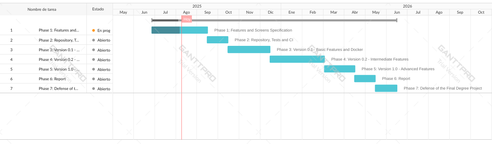

# 📝 Methodology

## 🧾 Table of Contents
- [Phase 1: Features and Screens Specification](#-phase-1-features-and-screens-specification)
- [Phase 2: Repository, Tests and CI](#-phase-2-repository-tests-and-ci)
- [Phase 3: Version 0.1 - Basic Features and Docker](#-phase-3-version-01---basic-features-and-docker)
- [Phase 4: Version 0.2 - Intermediate Features](#-phase-4-version-02---intermediate-features)
- [Phase 5: Version 1.0 - Advanced Features](#-phase-5-version-10---advanced-features)
- [Phase 6: Report](#-phase-6-report)
- [Phase 7: Defense of the Final Degree Project](#-phase-7-defense-of-the-final-degree-project)

## 📋 Phase 1: Features and Screens Specification
**Start Date:** June 26

**Due Date:** September 15

**Real End Date:** September 3

The application features will be defined and categorized as basic, intermediate, or advanced. Alongside this, an initial overview of the screens will be provided, specifying their purpose, transitions, and navigation flow. 

Additionally, the entities and their relationships will be defined, as well as the different user types and their corresponding permissions within the application.

## 🧪 Phase 2: Repository, Tests and CI
**Start Date:** September 9

**Due Date:** October 15

**Real End Date:** TBD

In this phase, the repository will be created along with the basic implementation required to connect the client, the server and the database. Furthermore, the first automated tests will be implemented and the Continous Integration (CI) system will be configured.

## 🐳 Phase 3: Version 0.1 - Basic Features and Docker
**Start Date:** TBD

**Due Date:** December 15

**Real End Date:** TBD

The basic features will be implemented along with their corresponding automated tests, and the application will be packaged using Docker (adding Continous Delivery). Finally, the 0.1 version will be released.

This phase will follow an **iterative and incremental development process**, meaning that the application will be built in small parts or increments, with features gradually added until the application is complete. Each increment will be reviewed and refined through successive iterations.

>[!NOTE]
> This process will also be followed in phases 4 through 5.

## 🟡 Phase 4: Version 0.2 - Intermediate Features
**Start Date:** TBD

**Due Date:** March 1

**Real End Date:** TBD

The intermediate features will be implemented along with their corresponding automated tests, and the application will also be packaged. Finally, the 0.2 version will be released.

## 🔴 Phase 5: Version 1.0 - Advanced Features
**Start Date:** TBD

**Due Date:** April 15

**Real End Date:** TBD

The advanced features will be implemented along with their corresponding automated tests, and the application will also be packaged. At this stage, the application will be complete and the 1.0 version will be released.

## 📄 Phase 6: Report
**Start Date:** TBD

**Due Date:** May 15

**Real End Date:** TBD

The first draft of the report will be prepared.

## 🎓 Phase 7: Defense of the Final Degree Project
**Start Date:** TBD

**Due Date:** June 15

**Real End Date:** TBD

The defense of the Final Degree Project will take place.

Below is a **Gantt Chart** that graphically reflects the planning mentioned above.

---
[👈 Return to README](../README.md)
